*A friendly, end-to-end guide to maintaining `main`, developing on `dev`, using feature branches, and shipping clean releases for the **spesim** R package.*

-----

## **TL;DR Quick Reference**

  - **Default Branch (`main`)**: Always stable, installable, and releasable.
  - **Integration Branch (`dev`)**: Where features are merged and tested together.
  - **Work Branches**: `feature/<short-desc>` or `fix/<short-desc>`, branched from `dev`.
  - **Core Flow**: `feature` → Pull Request into `dev` → Test on `dev` → Pull Request into `main` → Tag and Release.
  - **Versioning**: Semantic Versioning (`MAJOR.MINOR.PATCH`), e.g., `v0.1.0`.
  - **CI**: GitHub Actions run `R CMD check` on all pull requests to `dev` and `main`.

-----

## **1. The Branching Model**

Our workflow uses a simple and robust branching model to ensure the main branch is always stable while development continues on other branches.

### **Branch Relationships**

  - `main`: The official stable release branch. It is always installable and passing all checks.
  - `dev`: The integration branch for new features. It should be kept as stable as possible, but is a step behind `main` in terms of stability.
  - `feature/*`: Short-lived branches for new features or fixes, where all active development happens.

The diagram below illustrates the flow of code between branches.

```mermaid
gitGraph
    commit id: "v0.1.0 Release"
    branch dev
    commit id: "Dev setup"
    branch feature/add-new-model
    commit id: "Implement Neyman–Scott"
    commit id: "Add Strauss process"
    checkout dev
    merge feature/add-new-model
    commit id: "Integrate feature into dev"
    checkout main
    merge dev id: "Release v0.2.0"
```



### **Branch Details**

#### **Main Branch (`main`)**

The `main` branch is the official stable release branch.

  - It must always be stable, installable, and passing checks (`R CMD check` with 0 errors/warnings/notes if possible).
  - This branch is **protected**, requiring pull request reviews and passing CI checks before any code can be merged.
  - Official releases are created by tagging commits on this branch (e.g., `v0.1.0`).

#### **Development Branch (`dev`)**

The `dev` branch serves as the primary integration branch for new features.

  - It is created from `main`.
  - All completed feature branches are merged into `dev` first.
  - It is used for integrating and testing new features together before they are moved into a release.
  - While it can occasionally break, the goal is to keep it functional and passing CI checks.

#### **Feature Branches (`feature/*`)**

All new development, including features and non-urgent bug fixes, occurs on feature branches.

  - They are always branched from `dev`.
  - They should be named descriptively, using the prefix `feature/` or `fix/` (e.g., `feature/add-new-model` or `fix/strauss-process-bug`).
  - Once work is complete and tested, the branch is merged back into `dev` through a pull request.

-----

## **2. Day-to-Day Workflow**

This is the most common cycle you will follow for contributing new code.

1.  **Sync Your Local Repository**
    Before starting new work, ensure your local `dev` branch is up-to-date with the remote repository.

    ```bash
    git switch dev
    git pull --ff-only origin dev
    ```

2.  **Create a Feature Branch**
    Create a new branch for your work from the `dev` branch.

    ```bash
    git switch -c feature/your-short-description
    ```

3.  **Do the Work: Code, Test, Commit**

      - Write your code and corresponding tests.
      - Commit your work in small, logical units with clear messages.
      - Run checks locally and often to catch issues early.
        ```bash
        # Using devtools
        R -q -e "devtools::check(document = TRUE, cran = FALSE)"

        # Or using the base command
        R CMD check --as-cran .
        ```

4.  **Push and Open a Pull Request**
    When the feature is complete and tested, push your branch to GitHub and open a pull request to merge it into `dev`.

    ```bash
    git push -u origin feature/your-short-description
    # Now, go to GitHub to open a pull request from your branch into the `dev` branch.
    ```

-----

## **3. Pull Request (PR) Best Practices**

A well-crafted PR is easier to review and merge.

  - **Target `dev`**: All feature and bug-fix PRs should target the `dev` branch, not `main`.
  - **Clear Title**: Use a short, imperative title, like `feat: Add Thomas process sampler`.
  - **Detailed Body**: Use the PR template to explain the *what*, *why*, and *how* of your changes.
  - **Checklist**: Ensure all checks (CI, documentation, unit tests) are passing.
  - **Squash and Merge**: Use the "Squash and merge" option on GitHub to combine all of your commits into a single, clean commit on the `dev` branch. This keeps the project history tidy.
  - **Delete Branch**: Delete your feature branch after it has been merged.

### **The Pull Request (PR) Process: From Push to Merge**

A Pull Request is how you formally propose changes to the project. It's a request to "pull" your feature branch into another branch, which for daily work is always the `dev` branch.

#### **Step 1: Push Your Local Branch to GitHub**

After you have committed your changes locally, the first step is to push your feature branch from your computer to the remote repository on GitHub.

Use the following command, which sets your local branch to track the remote branch with the same name:

```bash
git push -u origin feature/your-short-description
```

#### **Step 2: Open the Pull Request on GitHub**

Once your branch is pushed, navigate to the project's GitHub page in your web browser.

1.  You will typically see a yellow banner with your branch name and a green "Compare & pull request" button. Click it.
2.  If you don't see the banner, click on the "Pull requests" tab and then click the "New pull request" button.
3.  **Set the branches**:
      * The **base** branch should be `dev`. This is the branch you want to merge your changes *into*.
      * The **compare** branch should be your `feature/your-short-description` branch. This is the branch with the changes you made.

#### **Step 3: Describe Your Pull Request**

This is a critical step for a smooth review.

  * **Title**: Write a clear, concise title. Following convention, you can prefix it with a type like `feat:` or `fix:`, for example: `feat: Add Thomas process sampler`.
  * **Body**: Use the PR template to provide a detailed description of your changes. Explain the motivation (why you made the change), a summary of the changes (what you did), and how you tested them.

#### **Step 4: Await Review and CI Checks**

After creating the PR:

  * **Automated Checks (CI)**: The Continuous Integration system will automatically run checks, such as `R CMD check`, to ensure your changes don't break the package. The status must be green (all checks passing) before merging.
  * **Code Review**: Team members will review your code, ask questions, and may request changes. Address their feedback by pushing new commits to the same feature branch. The PR will update automatically.

#### **Step 5: Squash and Merge**

Once the PR is approved and all checks are passing, a maintainer will merge it.

  * The preferred method is **Squash and Merge**. This combines all of your feature branch's commits into a single, clean commit on the `dev` branch, which keeps the project history tidy.
  * After merging, you can safely **delete your feature branch**.

### **PR Template**

```markdown
## Motivation
## Changes
-
-

## Testing
## Notes
```

-----

## **4. Creating a Release (`dev` → `main`)**

This process is typically handled by the repository maintainers.

1.  **Stabilize `dev`**
    Ensure all features for the release are merged into `dev`, CI is passing, `NEWS.md` is updated, and the `DESCRIPTION` file has the new version number.

2.  **Open a PR from `dev` to `main`**
    Create a pull request titled `Release vX.Y.Z` to merge the `dev` branch into `main`. This PR undergoes a final review.

3.  **Merge and Tag the Release**
    Once the PR is merged, create and push an annotated Git tag from your local `main` branch.

    ```bash
    git checkout main
    git pull --ff-only origin main
    git tag -a v0.2.0 -m "Release v0.2.0"
    git push origin v0.2.0
    ```

4.  **Draft GitHub Release**
    On GitHub, create a new release based on the tag you just pushed. Copy the changelog highlights from `NEWS.md` into the release description.

5.  **Sync `main` back to `dev`**
    To complete the cycle, merge the changes from `main` (including the release tag) back into `dev`.

    ```bash
    git switch dev
    git merge --ff-only main
    git push origin dev
    ```

-----

## **5. Handling Urgent Hotfixes**

For urgent fixes on a release, use a **hotfix branch**.

1.  **Branch from `main`**:
    ```bash
    git switch main
    git pull --ff-only
    git switch -c hotfix/urgent-cran-issue
    ```
2.  **Commit the fix** and push the branch.
3.  **Open a PR** from the hotfix branch into `main`.
4.  **Merge and tag** a new patch release (e.g., `v0.2.1`).
5.  **Forward-port the fix** to `dev` to ensure it's included in future development:
    ```bash
    git switch dev
    git pull --ff-only
    git merge --no-ff main # Use --no-ff to create a merge commit
    git push origin dev
    ```

-----

## **6. Versioning and Changelog**

  - **Semantic Versioning**: We follow `MAJOR.MINOR.PATCH` versioning.
      - **MAJOR**: For incompatible API changes.
      - **MINOR**: For adding functionality in a backward-compatible manner.
      - **PATCH**: For backward-compatible bug fixes.
  - **Changelog (`NEWS.md`)**: Maintain a `NEWS.md` file with a section for each release. Use headings to categorize changes: `Added`, `Changed`, `Fixed`, `Removed`.

-----

## **7. Continuous Integration (CI)**

We use GitHub Actions to automatically run `R CMD check` on all pushes and pull requests to `main` and `dev`. This ensures code quality and package integrity.

Here is an example workflow file (`.github/workflows/R-CMD-check.yaml`):

```yaml
name: R-CMD-check
on:
  push:
    branches: [ main, dev ]
  pull_request:
    branches: [ main, dev ]
jobs:
  R-CMD-check:
    runs-on: ${{ matrix.config.os }}
    name: ${{ matrix.config.os }} (${{ matrix.config.r }})
    strategy:
      fail-fast: false
      matrix:
        config:
          - {os: ubuntu-latest, r: 'release'}
          - {os: macos-latest,  r: 'release'}
          - {os: windows-latest, r: 'release'}
    steps:
      - uses: actions/checkout@v4
      - uses: r-lib/actions/setup-r@v2
        with:
          r-version: ${{ matrix.config.r }}
      - uses: r-lib/actions/setup-r-dependencies@v2
        with:
          extra-packages: any::rcmdcheck
          needs: check
      - uses: r-lib/actions/check-r-package@v2
        with:
          args: 'c("--no-manual")'
```

-----

## **8. Common Commands & Workflows**

**Update your feature branch with the latest from `dev`:**
If your feature branch is behind `dev`, use `rebase` to incorporate the latest changes. This keeps history linear.

```bash
git switch feature/my-feature
git fetch origin
git rebase origin/dev
# Resolve conflicts if any, then push
git push --force-with-lease
```

**Abandon a stale branch (locally and remote):**

```bash
# Delete local branch
git branch -D feature/old-idea

# Delete remote branch
git push origin --delete feature/old-idea
```

**Stash local changes:**
Temporarily shelve changes so you can switch branches.

```bash
git stash
git switch other-branch
# ... do work ...
git switch feature/my-feature
git stash pop # Re-apply your stashed changes
```

-----

## **9. Glossary**

  - **CI (Continuous Integration)**: Automated checks that verify code builds and passes tests.
  - **`dev`**: The integration branch for the upcoming release.
  - **`feature/*`**: Short-lived topic branches branched off `dev`.
  - **`hotfix/*`**: Urgent fix branches branched off `main`.
  - **`main`**: The stable, releasable branch.
  - **PR (Pull Request)**: A request to merge changes from one branch into another.
  - **Tag**: An immutable, named pointer to a specific commit, used to mark releases.

-----

Happy collaborating, and let's keep `main` clean, `dev` green, and ship often 🚀
