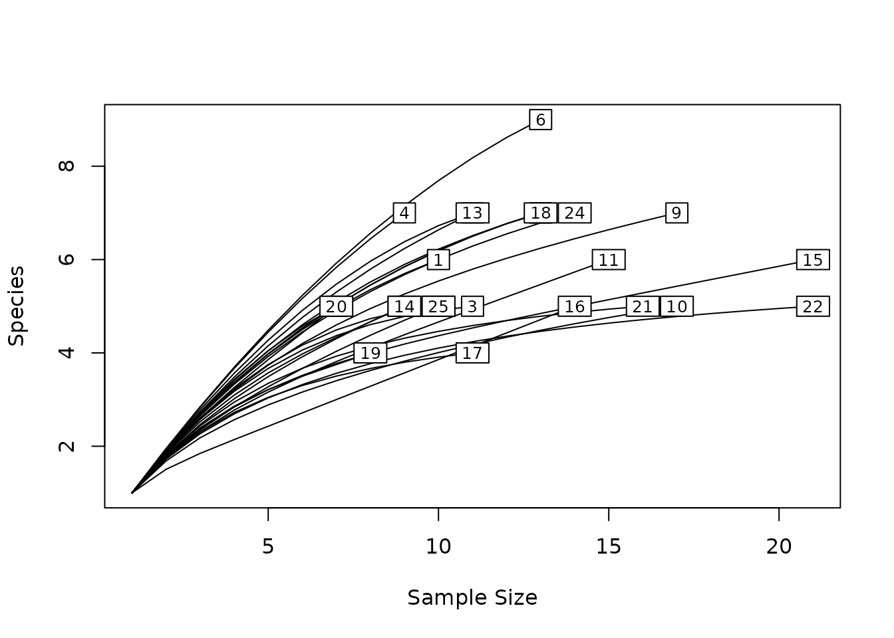
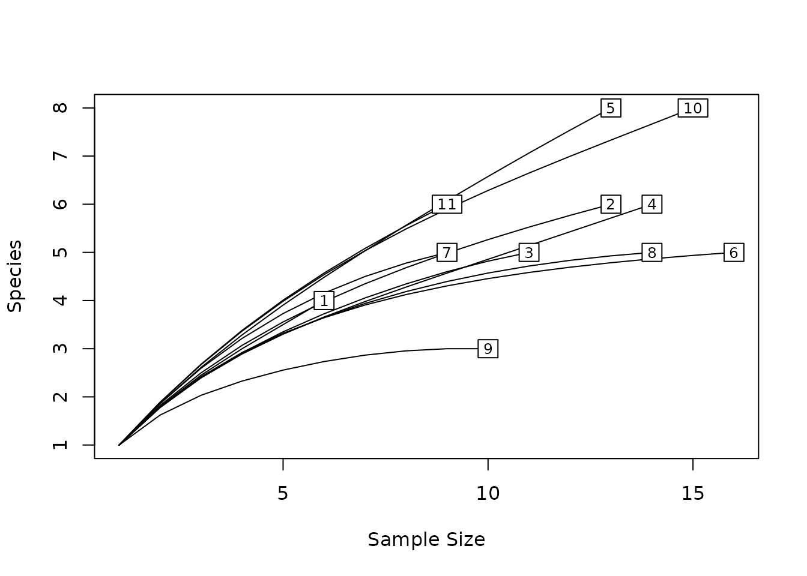
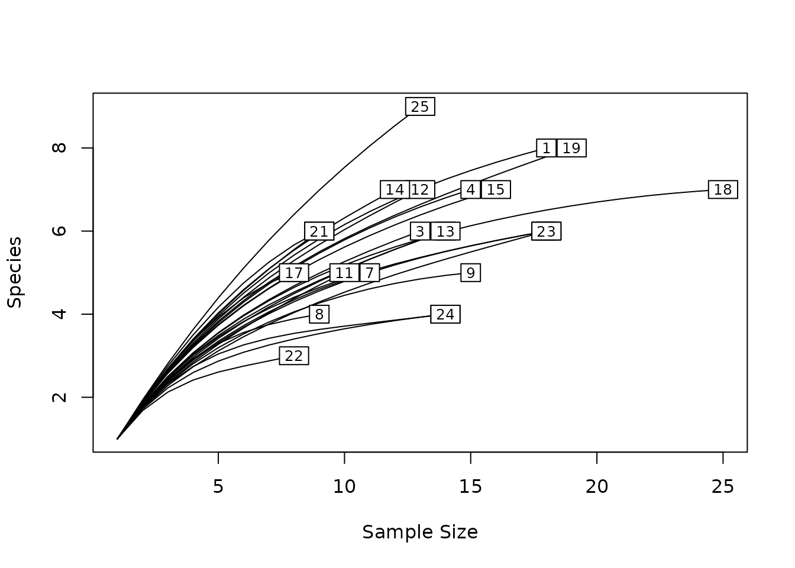
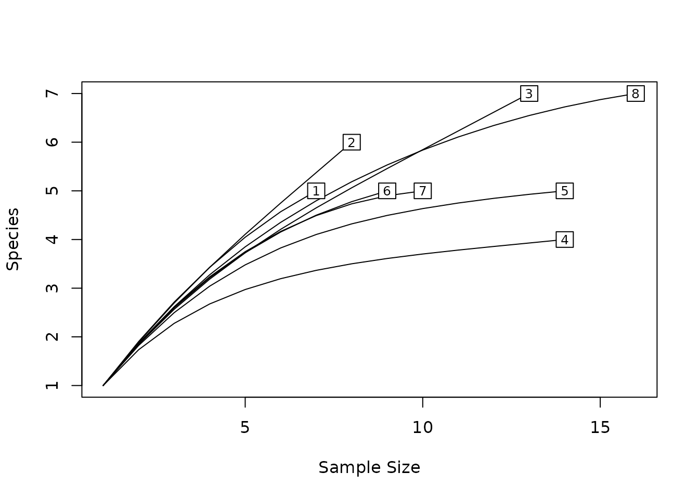

# Method testing with spesim

spesim is designed for **teaching** and **method testing**.

Method testing means: you keep the *underlying truth* fixed (the
simulated community + spatial process), and vary the **sampling design**
or **analysis choices**, then check how your conclusions change.

This vignette shows a simple, reproducible workflow:

1.  Run a baseline simulation.
2.  Re-run the **same truth** under different sampling schemes.
3.  Compare (i) what you would conclude from the usual plots/tables
    and (ii) what the **audit layer** says you actually got.

## 1. Start from a baseline parameter set

We start from the packaged init file and then modify only a few
parameters.

``` r
`%||%` <- function(a, b) if (!is.null(a)) a else b

init_file <- system.file("examples/spesim_init_basic.txt", package = "spesim")
if (identical(init_file, "")) {
  # Useful when rendering from the source tree without a prior install.
  # During local rendering, the working directory is typically `vignettes/`.
  cand <- c(
    file.path("..", "inst", "examples", "spesim_init_basic.txt"),
    file.path("..", "spesim_init_basic.txt")
  )
  init_file <- cand[file.exists(cand)][1]
}

P0 <- load_config(init_file)
#> ========== INITIALISING SPATIAL SAMPLING SIMULATION ==========

# Keep this vignette reasonably fast.
P0$N_INDIVIDUALS <- 1500L
P0$N_QUADRATS <- 25L

# Ensure we have filtering species (default init already does), and keep the report light.
P0$ADVANCED_ANALYSIS <- FALSE

# Fix seed so the *truth* is reproducible.
P0$SEED <- 123L
```

## 2. A helper to run the same truth under different sampling schemes

[`spesim_method_test()`](https://ajsmit.github.io/spesim/reference/spesim_method_test.md)
is a convenience wrapper that returns: - `res`: the simulation result -
`audit`: a lightweight audit of the realised regime - optional standard
plots and tables

``` r
run_scheme <- function(P, scheme) {
  P2 <- P
  P2$SAMPLING_SCHEME <- scheme

  # Keep audit deterministic and dependency-minimal for vignettes.
  spesim_method_test(P = P2, diagnostics = "nn", make_tables = TRUE, make_plots = FALSE)
}

schemes <- c("random", "systematic", "tiled", "transect", "voronoi")
outs <- setNames(lapply(schemes, function(s) run_scheme(P0, s)), schemes)
#> Note: no non-1 interactions for species: A, B, C, D, E, F, G, H, I, J.
#> ---- Interactions Summary ----
#> Species: 10 (A..J)
#> Radius : 0
#> Non-1 entries: 0 (0.0% of 100)
#> 
#> Matrix ('.' = 1):
#>   A B C D E F G H I J
#> A . . . . . . . . . .
#> B . . . . . . . . . .
#> C . . . . . . . . . .
#> D . . . . . . . . . .
#> E . . . . . . . . . .
#> F . . . . . . . . . .
#> G . . . . . . . . . .
#> H . . . . . . . . . .
#> I . . . . . . . . . .
#> J . . . . . . . . . .
#> ------------------------------
#> ========== INITIALISING SPATIAL SAMPLING SIMULATION ==========
#> ========== SIMULATION PARAMETERS ==========
#> list(SEED = 123L, OUTPUT_PREFIX = "out/run_basic", N_INDIVIDUALS = 1500L, 
#>     N_SPECIES = 10L, DOMINANT_FRACTION = 0.3, FISHER_ALPHA = 4.2, 
#>     FISHER_X = 0.95, GRADIENT_SPECIES = c("A", "B", "C", "D"), 
#>     GRADIENT_ASSIGNMENTS = c("temperature", "temperature", "elevation", 
#>     "rainfall"), GRADIENT_OPTIMA = 0.5, GRADIENT_TOLERANCE = 0.12, 
#>     SAMPLING_RESOLUTION = 50L, ENVIRONMENTAL_NOISE = 0.05, MAX_CLUSTERS_DOMINANT = 5, 
#>     CLUSTER_SPREAD_DOMINANT = 3, INTERACTION_RADIUS = 0, INTERACTION_MATRIX = structure(c(1, 
#>     1, 1, 1, 1, 1, 1, 1, 1, 1, 1, 1, 1, 1, 1, 1, 1, 1, 1, 1, 
#>     1, 1, 1, 1, 1, 1, 1, 1, 1, 1, 1, 1, 1, 1, 1, 1, 1, 1, 1, 
#>     1, 1, 1, 1, 1, 1, 1, 1, 1, 1, 1, 1, 1, 1, 1, 1, 1, 1, 1, 
#>     1, 1, 1, 1, 1, 1, 1, 1, 1, 1, 1, 1, 1, 1, 1, 1, 1, 1, 1, 
#>     1, 1, 1, 1, 1, 1, 1, 1, 1, 1, 1, 1, 1, 1, 1, 1, 1, 1, 1, 
#>     1, 1, 1, 1), dim = c(10L, 10L), dimnames = list(c("A", "B", 
#>     "C", "D", "E", "F", "G", "H", "I", "J"), c("A", "B", "C", 
#>     "D", "E", "F", "G", "H", "I", "J"))), INTERACTIONS_FILE = NULL, 
#>     INTERACTIONS_EDGELIST = NULL, SAMPLING_SCHEME = "random", 
#>     N_QUADRATS = 25L, QUADRAT_SIZE_OPTION = "medium", N_TRANSECTS = 1, 
#>     N_QUADRATS_PER_TRANSECT = 8, TRANSECT_ANGLE = 90, VORONOI_SEED_FACTOR = 10, 
#>     POINT_SIZE = 0.2, POINT_ALPHA = 1, QUADRAT_ALPHA = 0.05, 
#>     BACKGROUND_COLOUR = "white", FOREGROUND_COLOUR = "#22223b", 
#>     QUADRAT_COLOUR = "black", ADVANCED_ANALYSIS = FALSE, SPATIAL_PROCESS_A = "poisson", 
#>     A_PARENT_INTENSITY = NA_real_, A_MEAN_OFFSPRING = 10, A_CLUSTER_SCALE = 1, 
#>     SPATIAL_PROCESS_OTHERS = "poisson", OTHERS_BETA = NA_real_, 
#>     OTHERS_GAMMA = NA_real_, OTHERS_R = 1, OTHERS_S = 2, GRADIENT = structure(list(
#>         species = c("A", "B", "C", "D"), gradient = c("temperature", 
#>         "temperature", "elevation", "rainfall"), optimum = c(0.5, 
#>         0.5, 0.5, 0.5), tol = c(0.12, 0.12, 0.12, 0.12)), class = c("tbl_df", 
#>     "tbl", "data.frame"), row.names = c(NA, -4L))) 
#> 
#> ========== RUNNING SIMULATION ==========
#> Warning: attribute variables are assumed to be spatially constant throughout
#> all geometries
```



    #> Note: no non-1 interactions for species: A, B, C, D, E, F, G, H, I, J.
    #> ---- Interactions Summary ----
    #> Species: 10 (A..J)
    #> Radius : 0
    #> Non-1 entries: 0 (0.0% of 100)
    #> 
    #> Matrix ('.' = 1):
    #>   A B C D E F G H I J
    #> A . . . . . . . . . .
    #> B . . . . . . . . . .
    #> C . . . . . . . . . .
    #> D . . . . . . . . . .
    #> E . . . . . . . . . .
    #> F . . . . . . . . . .
    #> G . . . . . . . . . .
    #> H . . . . . . . . . .
    #> I . . . . . . . . . .
    #> J . . . . . . . . . .
    #> ------------------------------
    #> ========== INITIALISING SPATIAL SAMPLING SIMULATION ==========
    #> ========== SIMULATION PARAMETERS ==========
    #> list(SEED = 123L, OUTPUT_PREFIX = "out/run_basic", N_INDIVIDUALS = 1500L, 
    #>     N_SPECIES = 10L, DOMINANT_FRACTION = 0.3, FISHER_ALPHA = 4.2, 
    #>     FISHER_X = 0.95, GRADIENT_SPECIES = c("A", "B", "C", "D"), 
    #>     GRADIENT_ASSIGNMENTS = c("temperature", "temperature", "elevation", 
    #>     "rainfall"), GRADIENT_OPTIMA = 0.5, GRADIENT_TOLERANCE = 0.12, 
    #>     SAMPLING_RESOLUTION = 50L, ENVIRONMENTAL_NOISE = 0.05, MAX_CLUSTERS_DOMINANT = 5, 
    #>     CLUSTER_SPREAD_DOMINANT = 3, INTERACTION_RADIUS = 0, INTERACTION_MATRIX = structure(c(1, 
    #>     1, 1, 1, 1, 1, 1, 1, 1, 1, 1, 1, 1, 1, 1, 1, 1, 1, 1, 1, 
    #>     1, 1, 1, 1, 1, 1, 1, 1, 1, 1, 1, 1, 1, 1, 1, 1, 1, 1, 1, 
    #>     1, 1, 1, 1, 1, 1, 1, 1, 1, 1, 1, 1, 1, 1, 1, 1, 1, 1, 1, 
    #>     1, 1, 1, 1, 1, 1, 1, 1, 1, 1, 1, 1, 1, 1, 1, 1, 1, 1, 1, 
    #>     1, 1, 1, 1, 1, 1, 1, 1, 1, 1, 1, 1, 1, 1, 1, 1, 1, 1, 1, 
    #>     1, 1, 1, 1), dim = c(10L, 10L), dimnames = list(c("A", "B", 
    #>     "C", "D", "E", "F", "G", "H", "I", "J"), c("A", "B", "C", 
    #>     "D", "E", "F", "G", "H", "I", "J"))), INTERACTIONS_FILE = NULL, 
    #>     INTERACTIONS_EDGELIST = NULL, SAMPLING_SCHEME = "systematic", 
    #>     N_QUADRATS = 25L, QUADRAT_SIZE_OPTION = "medium", N_TRANSECTS = 1, 
    #>     N_QUADRATS_PER_TRANSECT = 8, TRANSECT_ANGLE = 90, VORONOI_SEED_FACTOR = 10, 
    #>     POINT_SIZE = 0.2, POINT_ALPHA = 1, QUADRAT_ALPHA = 0.05, 
    #>     BACKGROUND_COLOUR = "white", FOREGROUND_COLOUR = "#22223b", 
    #>     QUADRAT_COLOUR = "black", ADVANCED_ANALYSIS = FALSE, SPATIAL_PROCESS_A = "poisson", 
    #>     A_PARENT_INTENSITY = NA_real_, A_MEAN_OFFSPRING = 10, A_CLUSTER_SCALE = 1, 
    #>     SPATIAL_PROCESS_OTHERS = "poisson", OTHERS_BETA = NA_real_, 
    #>     OTHERS_GAMMA = NA_real_, OTHERS_R = 1, OTHERS_S = 2, GRADIENT = structure(list(
    #>         species = c("A", "B", "C", "D"), gradient = c("temperature", 
    #>         "temperature", "elevation", "rainfall"), optimum = c(0.5, 
    #>         0.5, 0.5, 0.5), tol = c(0.12, 0.12, 0.12, 0.12)), class = c("tbl_df", 
    #>     "tbl", "data.frame"), row.names = c(NA, -4L))) 
    #> 
    #> ========== RUNNING SIMULATION ==========
    #> Warning: attribute variables are assumed to be spatially constant throughout
    #> all geometries



    #> Note: no non-1 interactions for species: A, B, C, D, E, F, G, H, I, J.
    #> ---- Interactions Summary ----
    #> Species: 10 (A..J)
    #> Radius : 0
    #> Non-1 entries: 0 (0.0% of 100)
    #> 
    #> Matrix ('.' = 1):
    #>   A B C D E F G H I J
    #> A . . . . . . . . . .
    #> B . . . . . . . . . .
    #> C . . . . . . . . . .
    #> D . . . . . . . . . .
    #> E . . . . . . . . . .
    #> F . . . . . . . . . .
    #> G . . . . . . . . . .
    #> H . . . . . . . . . .
    #> I . . . . . . . . . .
    #> J . . . . . . . . . .
    #> ------------------------------
    #> ========== INITIALISING SPATIAL SAMPLING SIMULATION ==========
    #> ========== SIMULATION PARAMETERS ==========
    #> list(SEED = 123L, OUTPUT_PREFIX = "out/run_basic", N_INDIVIDUALS = 1500L, 
    #>     N_SPECIES = 10L, DOMINANT_FRACTION = 0.3, FISHER_ALPHA = 4.2, 
    #>     FISHER_X = 0.95, GRADIENT_SPECIES = c("A", "B", "C", "D"), 
    #>     GRADIENT_ASSIGNMENTS = c("temperature", "temperature", "elevation", 
    #>     "rainfall"), GRADIENT_OPTIMA = 0.5, GRADIENT_TOLERANCE = 0.12, 
    #>     SAMPLING_RESOLUTION = 50L, ENVIRONMENTAL_NOISE = 0.05, MAX_CLUSTERS_DOMINANT = 5, 
    #>     CLUSTER_SPREAD_DOMINANT = 3, INTERACTION_RADIUS = 0, INTERACTION_MATRIX = structure(c(1, 
    #>     1, 1, 1, 1, 1, 1, 1, 1, 1, 1, 1, 1, 1, 1, 1, 1, 1, 1, 1, 
    #>     1, 1, 1, 1, 1, 1, 1, 1, 1, 1, 1, 1, 1, 1, 1, 1, 1, 1, 1, 
    #>     1, 1, 1, 1, 1, 1, 1, 1, 1, 1, 1, 1, 1, 1, 1, 1, 1, 1, 1, 
    #>     1, 1, 1, 1, 1, 1, 1, 1, 1, 1, 1, 1, 1, 1, 1, 1, 1, 1, 1, 
    #>     1, 1, 1, 1, 1, 1, 1, 1, 1, 1, 1, 1, 1, 1, 1, 1, 1, 1, 1, 
    #>     1, 1, 1, 1), dim = c(10L, 10L), dimnames = list(c("A", "B", 
    #>     "C", "D", "E", "F", "G", "H", "I", "J"), c("A", "B", "C", 
    #>     "D", "E", "F", "G", "H", "I", "J"))), INTERACTIONS_FILE = NULL, 
    #>     INTERACTIONS_EDGELIST = NULL, SAMPLING_SCHEME = "tiled", 
    #>     N_QUADRATS = 25L, QUADRAT_SIZE_OPTION = "medium", N_TRANSECTS = 1, 
    #>     N_QUADRATS_PER_TRANSECT = 8, TRANSECT_ANGLE = 90, VORONOI_SEED_FACTOR = 10, 
    #>     POINT_SIZE = 0.2, POINT_ALPHA = 1, QUADRAT_ALPHA = 0.05, 
    #>     BACKGROUND_COLOUR = "white", FOREGROUND_COLOUR = "#22223b", 
    #>     QUADRAT_COLOUR = "black", ADVANCED_ANALYSIS = FALSE, SPATIAL_PROCESS_A = "poisson", 
    #>     A_PARENT_INTENSITY = NA_real_, A_MEAN_OFFSPRING = 10, A_CLUSTER_SCALE = 1, 
    #>     SPATIAL_PROCESS_OTHERS = "poisson", OTHERS_BETA = NA_real_, 
    #>     OTHERS_GAMMA = NA_real_, OTHERS_R = 1, OTHERS_S = 2, GRADIENT = structure(list(
    #>         species = c("A", "B", "C", "D"), gradient = c("temperature", 
    #>         "temperature", "elevation", "rainfall"), optimum = c(0.5, 
    #>         0.5, 0.5, 0.5), tol = c(0.12, 0.12, 0.12, 0.12)), class = c("tbl_df", 
    #>     "tbl", "data.frame"), row.names = c(NA, -4L))) 
    #> 
    #> ========== RUNNING SIMULATION ==========
    #> Warning: attribute variables are assumed to be spatially constant throughout
    #> all geometries



    #> Note: no non-1 interactions for species: A, B, C, D, E, F, G, H, I, J.
    #> ---- Interactions Summary ----
    #> Species: 10 (A..J)
    #> Radius : 0
    #> Non-1 entries: 0 (0.0% of 100)
    #> 
    #> Matrix ('.' = 1):
    #>   A B C D E F G H I J
    #> A . . . . . . . . . .
    #> B . . . . . . . . . .
    #> C . . . . . . . . . .
    #> D . . . . . . . . . .
    #> E . . . . . . . . . .
    #> F . . . . . . . . . .
    #> G . . . . . . . . . .
    #> H . . . . . . . . . .
    #> I . . . . . . . . . .
    #> J . . . . . . . . . .
    #> ------------------------------
    #> ========== INITIALISING SPATIAL SAMPLING SIMULATION ==========
    #> ========== SIMULATION PARAMETERS ==========
    #> list(SEED = 123L, OUTPUT_PREFIX = "out/run_basic", N_INDIVIDUALS = 1500L, 
    #>     N_SPECIES = 10L, DOMINANT_FRACTION = 0.3, FISHER_ALPHA = 4.2, 
    #>     FISHER_X = 0.95, GRADIENT_SPECIES = c("A", "B", "C", "D"), 
    #>     GRADIENT_ASSIGNMENTS = c("temperature", "temperature", "elevation", 
    #>     "rainfall"), GRADIENT_OPTIMA = 0.5, GRADIENT_TOLERANCE = 0.12, 
    #>     SAMPLING_RESOLUTION = 50L, ENVIRONMENTAL_NOISE = 0.05, MAX_CLUSTERS_DOMINANT = 5, 
    #>     CLUSTER_SPREAD_DOMINANT = 3, INTERACTION_RADIUS = 0, INTERACTION_MATRIX = structure(c(1, 
    #>     1, 1, 1, 1, 1, 1, 1, 1, 1, 1, 1, 1, 1, 1, 1, 1, 1, 1, 1, 
    #>     1, 1, 1, 1, 1, 1, 1, 1, 1, 1, 1, 1, 1, 1, 1, 1, 1, 1, 1, 
    #>     1, 1, 1, 1, 1, 1, 1, 1, 1, 1, 1, 1, 1, 1, 1, 1, 1, 1, 1, 
    #>     1, 1, 1, 1, 1, 1, 1, 1, 1, 1, 1, 1, 1, 1, 1, 1, 1, 1, 1, 
    #>     1, 1, 1, 1, 1, 1, 1, 1, 1, 1, 1, 1, 1, 1, 1, 1, 1, 1, 1, 
    #>     1, 1, 1, 1), dim = c(10L, 10L), dimnames = list(c("A", "B", 
    #>     "C", "D", "E", "F", "G", "H", "I", "J"), c("A", "B", "C", 
    #>     "D", "E", "F", "G", "H", "I", "J"))), INTERACTIONS_FILE = NULL, 
    #>     INTERACTIONS_EDGELIST = NULL, SAMPLING_SCHEME = "transect", 
    #>     N_QUADRATS = 25L, QUADRAT_SIZE_OPTION = "medium", N_TRANSECTS = 1, 
    #>     N_QUADRATS_PER_TRANSECT = 8, TRANSECT_ANGLE = 90, VORONOI_SEED_FACTOR = 10, 
    #>     POINT_SIZE = 0.2, POINT_ALPHA = 1, QUADRAT_ALPHA = 0.05, 
    #>     BACKGROUND_COLOUR = "white", FOREGROUND_COLOUR = "#22223b", 
    #>     QUADRAT_COLOUR = "black", ADVANCED_ANALYSIS = FALSE, SPATIAL_PROCESS_A = "poisson", 
    #>     A_PARENT_INTENSITY = NA_real_, A_MEAN_OFFSPRING = 10, A_CLUSTER_SCALE = 1, 
    #>     SPATIAL_PROCESS_OTHERS = "poisson", OTHERS_BETA = NA_real_, 
    #>     OTHERS_GAMMA = NA_real_, OTHERS_R = 1, OTHERS_S = 2, GRADIENT = structure(list(
    #>         species = c("A", "B", "C", "D"), gradient = c("temperature", 
    #>         "temperature", "elevation", "rainfall"), optimum = c(0.5, 
    #>         0.5, 0.5, 0.5), tol = c(0.12, 0.12, 0.12, 0.12)), class = c("tbl_df", 
    #>     "tbl", "data.frame"), row.names = c(NA, -4L))) 
    #> 
    #> ========== RUNNING SIMULATION ==========
    #> Warning: attribute variables are assumed to be spatially constant throughout
    #> all geometries



    #> Note: no non-1 interactions for species: A, B, C, D, E, F, G, H, I, J.
    #> ---- Interactions Summary ----
    #> Species: 10 (A..J)
    #> Radius : 0
    #> Non-1 entries: 0 (0.0% of 100)
    #> 
    #> Matrix ('.' = 1):
    #>   A B C D E F G H I J
    #> A . . . . . . . . . .
    #> B . . . . . . . . . .
    #> C . . . . . . . . . .
    #> D . . . . . . . . . .
    #> E . . . . . . . . . .
    #> F . . . . . . . . . .
    #> G . . . . . . . . . .
    #> H . . . . . . . . . .
    #> I . . . . . . . . . .
    #> J . . . . . . . . . .
    #> ------------------------------
    #> ========== INITIALISING SPATIAL SAMPLING SIMULATION ==========
    #> ========== SIMULATION PARAMETERS ==========
    #> list(SEED = 123L, OUTPUT_PREFIX = "out/run_basic", N_INDIVIDUALS = 1500L, 
    #>     N_SPECIES = 10L, DOMINANT_FRACTION = 0.3, FISHER_ALPHA = 4.2, 
    #>     FISHER_X = 0.95, GRADIENT_SPECIES = c("A", "B", "C", "D"), 
    #>     GRADIENT_ASSIGNMENTS = c("temperature", "temperature", "elevation", 
    #>     "rainfall"), GRADIENT_OPTIMA = 0.5, GRADIENT_TOLERANCE = 0.12, 
    #>     SAMPLING_RESOLUTION = 50L, ENVIRONMENTAL_NOISE = 0.05, MAX_CLUSTERS_DOMINANT = 5, 
    #>     CLUSTER_SPREAD_DOMINANT = 3, INTERACTION_RADIUS = 0, INTERACTION_MATRIX = structure(c(1, 
    #>     1, 1, 1, 1, 1, 1, 1, 1, 1, 1, 1, 1, 1, 1, 1, 1, 1, 1, 1, 
    #>     1, 1, 1, 1, 1, 1, 1, 1, 1, 1, 1, 1, 1, 1, 1, 1, 1, 1, 1, 
    #>     1, 1, 1, 1, 1, 1, 1, 1, 1, 1, 1, 1, 1, 1, 1, 1, 1, 1, 1, 
    #>     1, 1, 1, 1, 1, 1, 1, 1, 1, 1, 1, 1, 1, 1, 1, 1, 1, 1, 1, 
    #>     1, 1, 1, 1, 1, 1, 1, 1, 1, 1, 1, 1, 1, 1, 1, 1, 1, 1, 1, 
    #>     1, 1, 1, 1), dim = c(10L, 10L), dimnames = list(c("A", "B", 
    #>     "C", "D", "E", "F", "G", "H", "I", "J"), c("A", "B", "C", 
    #>     "D", "E", "F", "G", "H", "I", "J"))), INTERACTIONS_FILE = NULL, 
    #>     INTERACTIONS_EDGELIST = NULL, SAMPLING_SCHEME = "voronoi", 
    #>     N_QUADRATS = 25L, QUADRAT_SIZE_OPTION = "medium", N_TRANSECTS = 1, 
    #>     N_QUADRATS_PER_TRANSECT = 8, TRANSECT_ANGLE = 90, VORONOI_SEED_FACTOR = 10, 
    #>     POINT_SIZE = 0.2, POINT_ALPHA = 1, QUADRAT_ALPHA = 0.05, 
    #>     BACKGROUND_COLOUR = "white", FOREGROUND_COLOUR = "#22223b", 
    #>     QUADRAT_COLOUR = "black", ADVANCED_ANALYSIS = FALSE, SPATIAL_PROCESS_A = "poisson", 
    #>     A_PARENT_INTENSITY = NA_real_, A_MEAN_OFFSPRING = 10, A_CLUSTER_SCALE = 1, 
    #>     SPATIAL_PROCESS_OTHERS = "poisson", OTHERS_BETA = NA_real_, 
    #>     OTHERS_GAMMA = NA_real_, OTHERS_R = 1, OTHERS_S = 2, GRADIENT = structure(list(
    #>         species = c("A", "B", "C", "D"), gradient = c("temperature", 
    #>         "temperature", "elevation", "rainfall"), optimum = c(0.5, 
    #>         0.5, 0.5, 0.5), tol = c(0.12, 0.12, 0.12, 0.12)), class = c("tbl_df", 
    #>     "tbl", "data.frame"), row.names = c(NA, -4L))) 
    #> 
    #> ========== RUNNING SIMULATION ==========
    #> Warning in place_quadrats_voronoi(domain, P$N_QUADRATS, P$QUADRAT_SIZE, :
    #> Voronoi placement found 1 suitable locations; using all.
    #> Warning in place_quadrats_voronoi(domain, P$N_QUADRATS, P$QUADRAT_SIZE, :
    #> attribute variables are assumed to be spatially constant throughout all
    #> geometries


## 3. Compare the sampling audits (what did the sampling design *actually* do?)

Sampling schemes differ in how much they are constrained by the boundary
and by the non-overlap rule.

``` r
sampling_summary <- bind_rows(lapply(names(outs), function(s) {
  a <- outs[[s]]$audit
  data.frame(
    scheme = s,
    n_requested = a$sampling$n_requested %||% NA_integer_,
    n_returned  = a$sampling$n_returned  %||% NA_integer_,
    reject_boundary = a$sampling$reject_boundary %||% NA_integer_,
    reject_overlap  = a$sampling$reject_overlap  %||% NA_integer_,
    safe_area_fraction = a$sampling$safe_area_fraction %||% NA_real_
  )
}))

sampling_summary
#>       scheme n_requested n_returned reject_boundary reject_overlap
#> 1     random          25         25              76             32
#> 2 systematic          25         11              NA             NA
#> 3      tiled          25         25              NA             NA
#> 4   transect           8          8              NA             NA
#> 5    voronoi           1          1              NA             NA
#>   safe_area_fraction
#> 1          0.7249067
#> 2          0.7020939
#> 3          0.6938762
#> 4          0.7033130
#> 5          0.6934152
```

Interpretation tips:

- `safe_area_fraction` is a conservative estimate of how much of the
  domain is a feasible sampling frame for quadrat *centres*.
- High `reject_boundary` or low `safe_area_fraction` means your design
  is effectively sampling the interior only.

## 4. Compare how the same truth looks under different schemes

A small, practical comparison is to look at a few common summaries.

### 4.1 Mean richness and abundance per quadrat

``` r
quadrat_summaries <- bind_rows(lapply(names(outs), function(s) {
  res <- outs[[s]]$res
  abund <- res$abund_matrix[, setdiff(colnames(res$abund_matrix), "site"), drop = FALSE]

  data.frame(
    scheme = s,
    mean_richness = mean(rowSums(abund > 0)),
    mean_abundance = mean(rowSums(abund))
  )
}))

quadrat_summaries
#>       scheme mean_richness mean_abundance
#> 1     random      5.840000       12.40000
#> 2 systematic      5.545455       11.81818
#> 3      tiled      5.920000       13.64000
#> 4   transect      5.500000       11.37500
#> 5    voronoi      7.000000       15.00000
```

### 4.2 Distance-decay (beta diversity vs distance)

We compute a distance-decay table for each scheme and compare the
*fitted slope*.

``` r
slopes <- bind_rows(lapply(names(outs), function(s) {
  res <- outs[[s]]$res
  dd <- calculate_distance_decay(res$abund_matrix, res$site_coords)

  # Simple linear trend (teaching-level summary): dissimilarity ~ distance
  if (nrow(dd) == 0) {
    return(data.frame(scheme = s, slope = NA_real_, r2 = NA_real_))
  }
  fit <- lm(Dissimilarity ~ Distance, data = dd)

  data.frame(
    scheme = s,
    slope = unname(coef(fit)["Distance"]),
    r2 = summary(fit)$r.squared
  )
}))

slopes
#>       scheme        slope         r2
#> 1     random  0.004511566 0.01618506
#> 2 systematic  0.005884142 0.02241046
#> 3      tiled -0.005500507 0.02240296
#> 4   transect -0.007466606 0.05806674
#> 5    voronoi           NA         NA
```

**Method-testing point:** If different sampling schemes change the slope
materially, your inference about spatial turnover may be
design-sensitive.

## 5. Use the audit layer to prevent over-interpretation

The audit tells you whether the regime you *think* you requested is
visible in the sampled data.

For example, environmental filtering checks can be noisy when a species
is sparse.

``` r
filtering_summary <- bind_rows(lapply(names(outs), function(s) {
  f <- outs[[s]]$audit$filtering
  if (nrow(f) == 0) return(data.frame())

  # Keep a compact view for the vignette
  f %>%
    mutate(scheme = s) %>%
    select(scheme, species, gradient, n_sites, occupancy_sites, rho, slope, qualitative)
}))

filtering_summary
#>        scheme species    gradient n_sites occupancy_sites          rho
#> 1      random       A temperature      25              25  0.299943666
#> 2      random       B temperature      25              20  0.065567997
#> 3      random       C   elevation      25              21 -0.279300750
#> 4      random       D    rainfall      25              14 -0.014387828
#> 5  systematic       A temperature      11              11 -0.032336789
#> 6  systematic       B temperature      11               9 -0.089034247
#> 7  systematic       C   elevation      11              10 -0.229062013
#> 8  systematic       D    rainfall      11               8  0.355801456
#> 9       tiled       A temperature      25              25  0.005884661
#> 10      tiled       B temperature      25              22 -0.013641104
#> 11      tiled       C   elevation      25              15  0.578694899
#> 12      tiled       D    rainfall      25              18 -0.081057613
#> 13   transect       A temperature       8               8  0.692934867
#> 14   transect       B temperature       8               8  0.133355377
#> 15   transect       C   elevation       8               8 -0.089391653
#> 16   transect       D    rainfall       8               5 -0.100125235
#> 17    voronoi       A temperature       1               1           NA
#> 18    voronoi       B temperature       1               1           NA
#> 19    voronoi       C   elevation       1               0           NA
#> 20    voronoi       D    rainfall       1               0           NA
#>            slope                  qualitative
#> 1  -0.9449409864 abundance_peaks_near_optimum
#> 2  -0.0511682407            weak_or_no_signal
#> 3   0.3777425766         opposite_of_expected
#> 4  -0.0004764026            weak_or_no_signal
#> 5   0.5250213182            weak_or_no_signal
#> 6   0.0526804636            weak_or_no_signal
#> 7   0.3175774056         opposite_of_expected
#> 8  -0.2643224750 abundance_peaks_near_optimum
#> 9  -0.1170290847            weak_or_no_signal
#> 10  0.2215231814            weak_or_no_signal
#> 11 -0.5891509914 abundance_peaks_near_optimum
#> 12 -0.0227589367            weak_or_no_signal
#> 13 -0.9841506131 abundance_peaks_near_optimum
#> 14 -0.0310188019            weak_or_no_signal
#> 15  0.4941555268            weak_or_no_signal
#> 16 -0.0064338071            weak_or_no_signal
#> 17            NA                too_few_sites
#> 18            NA                too_few_sites
#> 19            NA                too_few_sites
#> 20            NA                too_few_sites
```

Interpretation tips:

- Prefer filtering interpretations when `occupancy_sites` is not tiny.
- Treat `too_sparse_to_assess` as a guardrail: it means *your sampled
  data don’t support a strong statement*.

## 6. What to do next

To turn this into a real method-testing exercise:

- Repeat the comparison under different domain shapes (e.g., very
  concave polygons).
- Vary quadrat size and number of quadrats.
- Hold sampling fixed and vary the spatial process (Poisson vs Strauss
  vs Thomas).
- Use `spesim_audit(..., diagnostics = c("nn", "spatstat"))` when
  `spatstat` is installed for edge-corrected point-process diagnostics.
