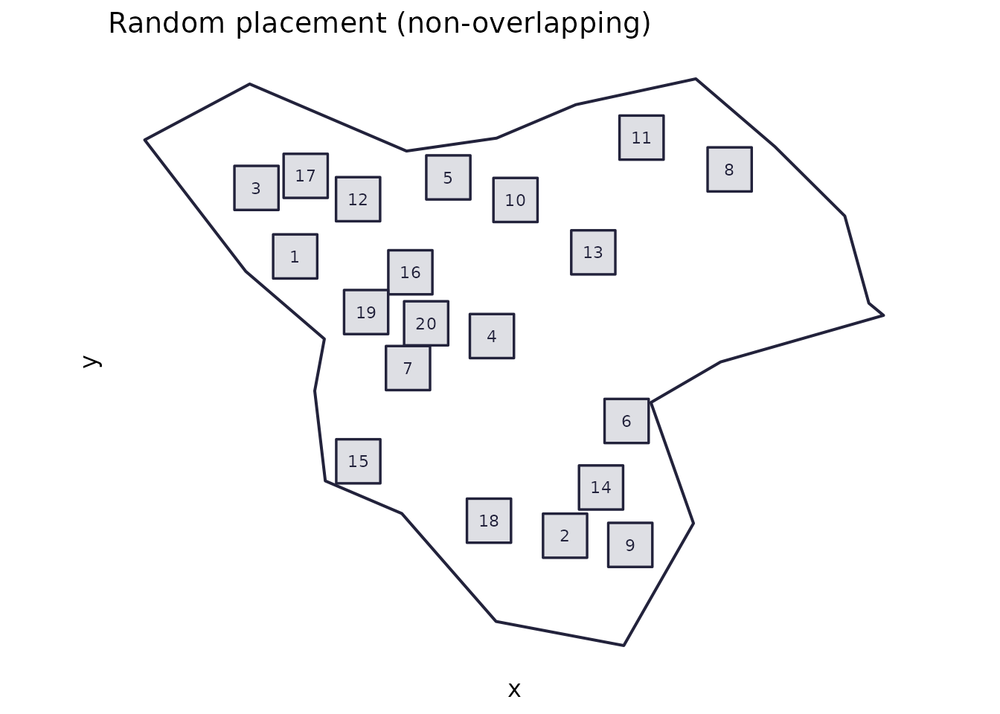
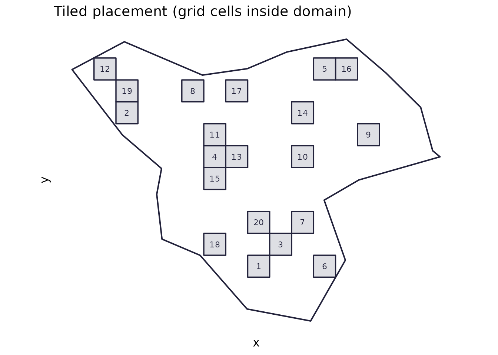
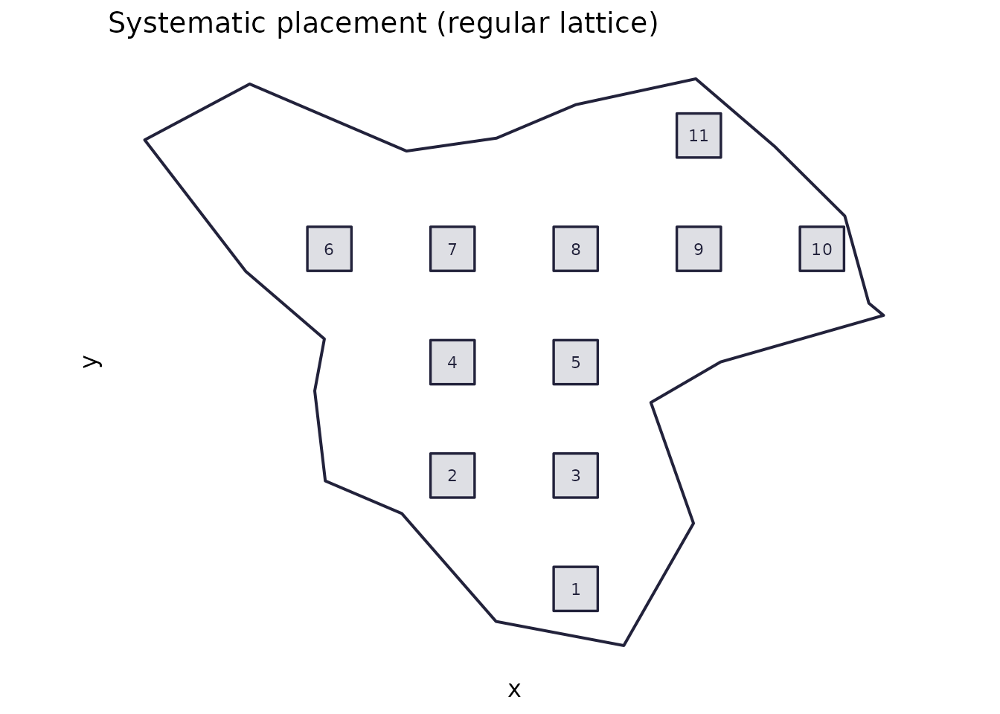
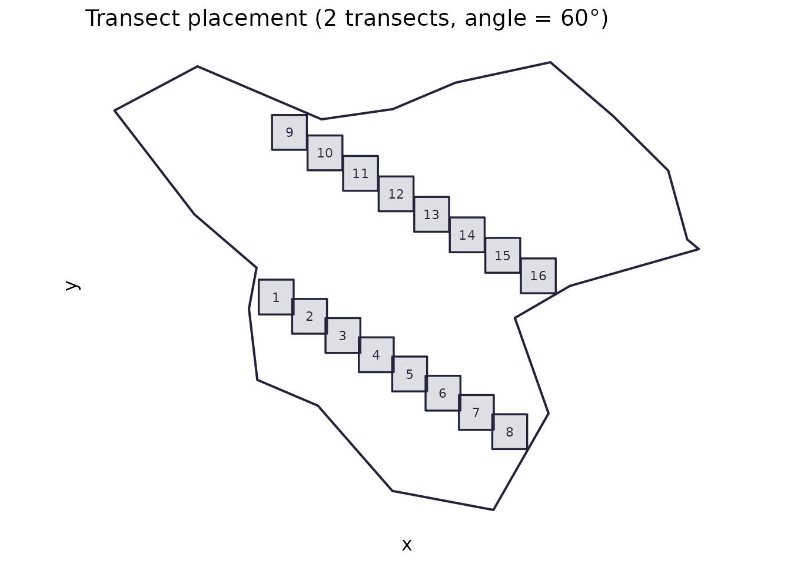
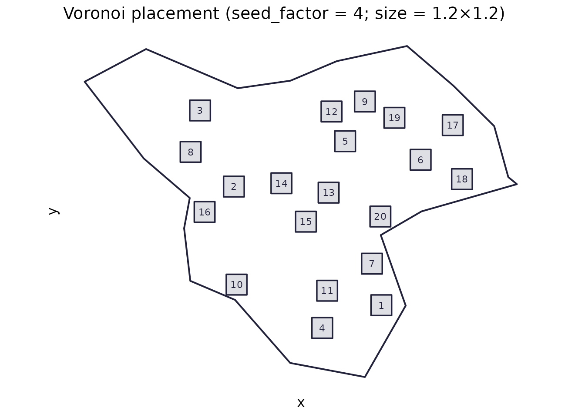
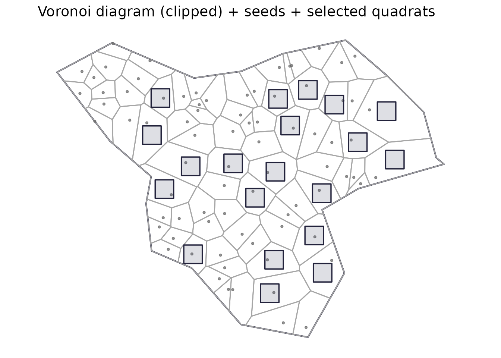

# Quadrat placement schemes in spesim

This vignette shows the **five quadrat placement schemes** available in
**spesim**, with reproducible code and simple visualisations for each:

- `random` →
  \[[`place_quadrats()`](https://ajsmit.github.io/spesim/reference/place_quadrats.md)\]
- `tiled` →
  \[[`place_quadrats_tiled()`](https://ajsmit.github.io/spesim/reference/place_quadrats_tiled.md)\]
- `systematic` →
  \[[`place_quadrats_systematic()`](https://ajsmit.github.io/spesim/reference/place_quadrats_systematic.md)\]
- `transect` →
  \[[`place_quadrats_transect()`](https://ajsmit.github.io/spesim/reference/place_quadrats_transect.md)\]
- `voronoi` →
  \[[`place_quadrats_voronoi()`](https://ajsmit.github.io/spesim/reference/place_quadrats_voronoi.md)\]

All schemes place **axis-aligned rectangular quadrats** (i.e., not
rotated). Each function attempts to ensure quadrats lie fully within the
sampling domain; specific constraints differ by scheme.

## Setup: a shared irregular domain

``` r
library(spesim)
#> spesim loaded - try run_spatial_simulation() to generate a simulation.
library(sf)
#> Linking to GEOS 3.12.1, GDAL 3.8.4, PROJ 9.4.0; sf_use_s2() is TRUE
library(ggplot2)

set.seed(1)
domain <- create_sampling_domain()

# Quadrat size is given in the domain's coordinate units.
# The default domain is synthetic and uses an arbitrary planar scale.
quadrat_size <- c(1.5, 1.5)
```

A small helper to plot the domain + quadrats consistently:

``` r
# Plotting helper (exported by spesim)
# See ?plot_quadrats for arguments.
```

## 1) Random (non-overlapping) placement

**Use when:** you want *simple random sampling* and you don’t want
quadrats overlapping.

**Mechanics:** rejection sampling of random centres (uniform over a
shrunk bounding box), accepting only quadrats that are **fully inside**
the domain and **do not overlap** already accepted quadrats.

``` r
set.seed(2)
q_random <- place_quadrats(domain, n_quadrats = 20, quadrat_size = quadrat_size)
plot_quadrats(domain, q_random, "Random placement (non-overlapping)")
```



**Notes:**

- If the domain is small or the quadrats are large, you may get fewer
  quadrats than requested (with a warning).
- This is often a good default for teaching.

## 2) Tiled placement

**Use when:** you want quadrats drawn from a **regular tiling**, with
strict non-overlap.

**Mechanics:** a regular grid of cells (`st_make_grid`) at the quadrat
size is created; tiles fully inside the domain are candidates;
`n_quadrats` are sampled from these candidates.

``` r
set.seed(3)
q_tiled <- place_quadrats_tiled(domain, n_quadrats = 20, quadrat_size = quadrat_size)
plot_quadrats(domain, q_tiled, "Tiled placement (grid cells inside domain)")
```



**Notes:**

- Returned quadrats never overlap.
- If the domain has narrow “necks”, many grid cells may be excluded.

## 3) Systematic placement

**Use when:** you want a **regular lattice** of quadrats (systematic
sampling).

**Mechanics:** centres are placed on an `nx × ny` grid spanning the
domain bounding box; quadrats centred on those points are retained only
if they fit entirely in the domain.

``` r
set.seed(4)
q_systematic <- place_quadrats_systematic(domain, n_quadrats = 25, quadrat_size = quadrat_size)
plot_quadrats(domain, q_systematic, "Systematic placement (regular lattice)")
```



**Notes:**

- The *actual* number returned may differ from `n_quadrats` because the
  grid is filtered by the domain boundary.
- Quadrats may overlap if the grid spacing is smaller than the quadrat
  size (this depends on the inferred grid density).

## 4) Transect placement

**Use when:** you want **transect-based sampling** (parallel lines
across the domain) with evenly spaced quadrats along each transect.

**Mechanics:** `n_transects` parallel lines are created across a *safe
area* (domain shrunk by half the quadrat diagonal). Along each transect
segment, `n_quadrats_per_transect` quadrats are placed.

``` r
set.seed(5)
q_transect <- place_quadrats_transect(
  domain,
  n_transects = 2,
  n_quadrats_per_transect = 8,
  quadrat_size = quadrat_size,
  angle = 60
)
plot_quadrats(domain, q_transect, "Transect placement (2 transects, angle = 60°)")
```



**Notes:**

- The quadrats themselves remain axis-aligned, even if transects run at
  an angle.
- If the safe area becomes too small (large quadrats, narrow domain),
  few or no quadrats may be returned.

## 5) Voronoi-based placement

**Use when:** you want sampling locations that are **well-spaced** in
complex domains.

**Mechanics:** a dense set of random seed points are placed in the
domain; a Voronoi tessellation is computed; cells are screened for
whether they can contain the quadrat (based on an inscribed circle
heuristic). Quadrats are placed at cell centres.

``` r
set.seed(6)
# Note: very large voronoi_seed_factor values tend to create many small cells,
# which can make it impossible to fit larger quadrats. If you get an empty
# result, either reduce `voronoi_seed_factor` or use a smaller quadrat_size.
q_voronoi <- place_quadrats_voronoi(
  domain,
  n_quadrats = 20,
  quadrat_size = c(1.2, 1.2),
  voronoi_seed_factor = 4,
  show_voronoi = TRUE
)
#> Warning in st_collection_extract.sfc(voronoi_geom, "POLYGON"): x is already of
#> type POLYGON.

# Standard view (domain + quadrats)
plot_quadrats(domain, q_voronoi, "Voronoi placement (seed_factor = 4; size = 1.2×1.2)")
```



``` r

# Optional: show the underlying Voronoi tessellation used to select candidates
vor_cells <- attr(q_voronoi, "voronoi_cells")

seeds <- attr(q_voronoi, "voronoi_seeds")

p_voronoi_diag <- ggplot() +
  geom_sf(data = domain, fill = NA, colour = "#22223b", linewidth = 0.7) +
  geom_sf(data = vor_cells, fill = NA, colour = "grey65", linewidth = 0.5) +
  geom_sf(data = sf::st_as_sf(seeds), colour = "grey40", alpha = 0.7, size = 0.8) +
  geom_sf(data = q_voronoi, fill = "#4a4e69", alpha = 0.18, colour = "#22223b", linewidth = 0.6) +
  coord_sf(datum = NA) +
  labs(title = "Voronoi diagram (clipped) + seeds + selected quadrats") +
  theme_minimal(base_size = 12) +
  theme(panel.grid.major = element_blank(), panel.grid.minor = element_blank())

print(p_voronoi_diag)
```



**Notes:**

- For narrow or very irregular domains, increase `voronoi_seed_factor`
  (at a computational cost).
- The current implementation focuses on finding feasible, nicely spaced
  sites; it is not designed to guarantee strict non-overlap in all cases
  (though overlap is uncommon for moderate sizes).

## Summary: when to use which

- **Random**: general-purpose, classic random sampling, non-overlapping.
- **Tiled**: systematic grid *cells*; great for “choose random cells
  from a tiling”.
- **Systematic**: classic lattice-based systematic sampling.
- **Transect**: teaching/field designs with transects.
- **Voronoi**: irregular domains where you want good spatial coverage
  and spacing.

## Reproducibility tip

All schemes are stochastic to some degree (even the systematic scheme
can depend on inferred grid dimensions); for reproducible figures, set a
seed immediately before each placement call.
