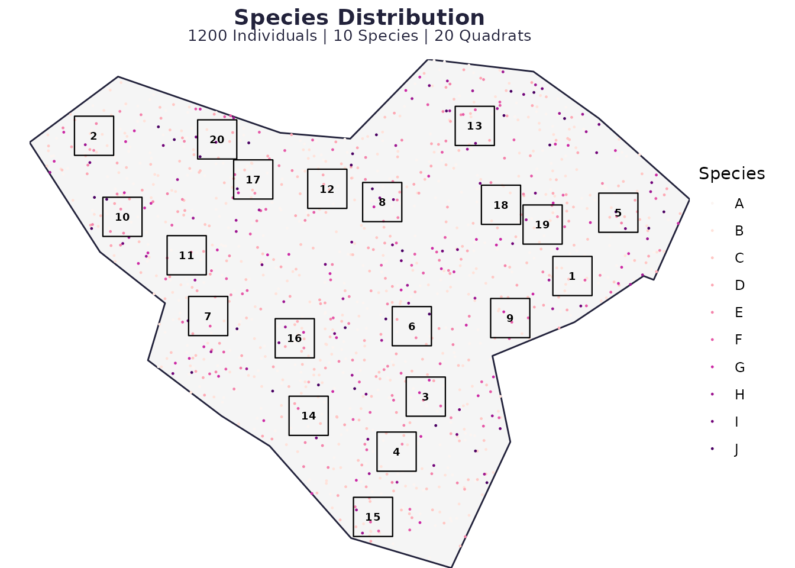
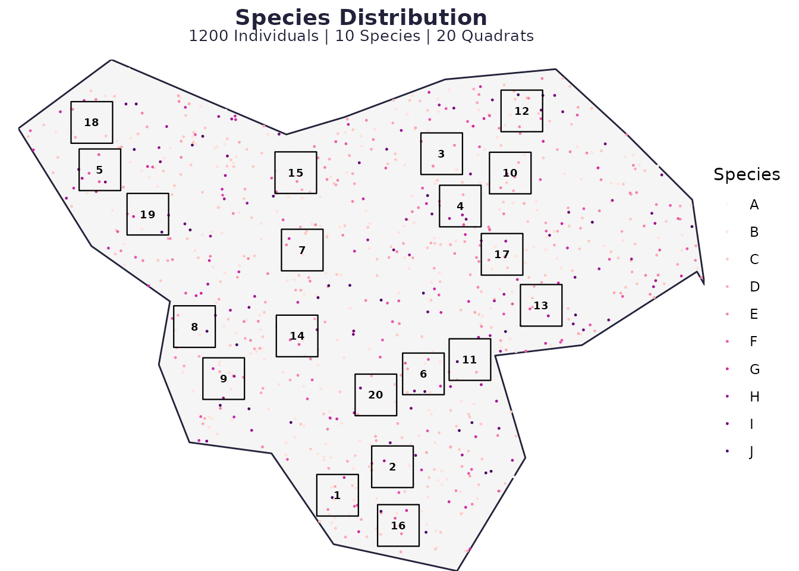
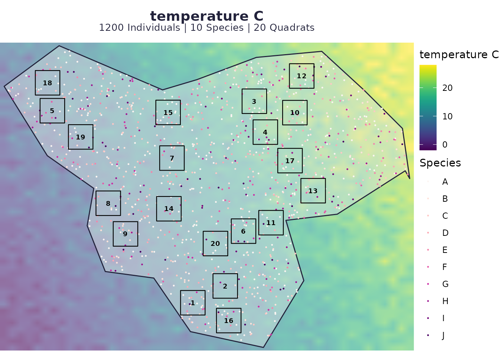
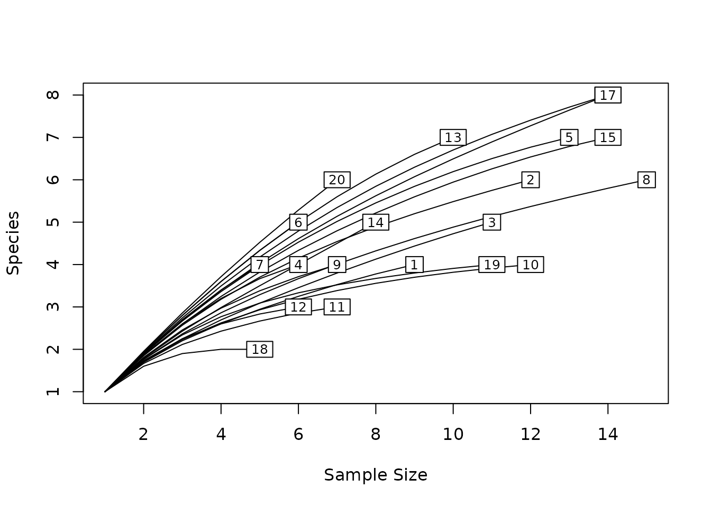
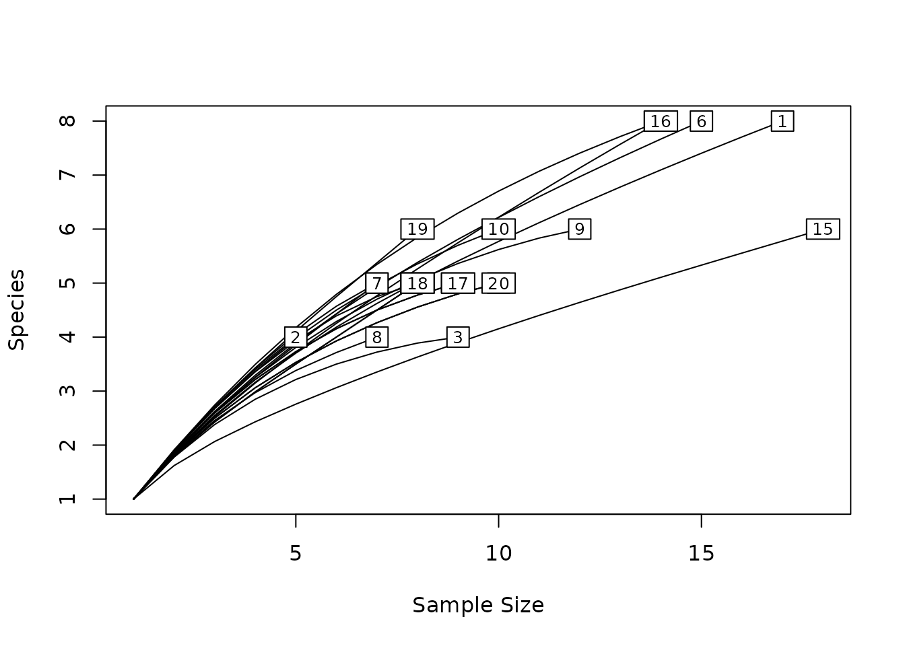
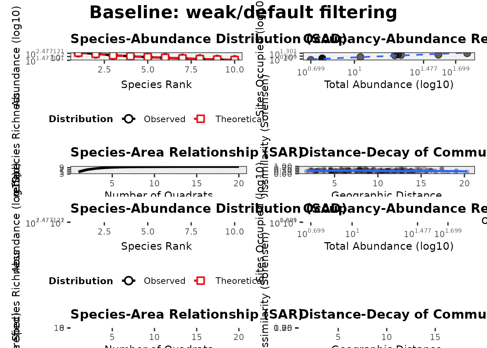

# spesim recipes: environmental gradients

This short recipe shows how to turn **environmental filtering** on and
off, and how to change **optima/tolerances** for gradient-responsive
species.

## Minimal run (no special gradients)

``` r
library(spesim)
#> spesim loaded - try run_spatial_simulation() to generate a simulation.

P <- load_config(system.file("examples/spesim_init_basic.txt", package = "spesim"))
#> ========== INITIALISING SPATIAL SAMPLING SIMULATION ==========
P$N_SPECIES <- 10
P$N_INDIVIDUALS <- 1200
P$ADVANCED_ANALYSIS <- FALSE

set.seed(P$SEED)
res0 <- run_spatial_simulation(P = P, write_outputs = FALSE)
#> Note: no non-1 interactions for species: A, B, C, D, E, F, G, H, I, J.
#> ---- Interactions Summary ----
#> Species: 10 (A..J)
#> Radius : 0
#> Non-1 entries: 0 (0.0% of 100)
#> 
#> Matrix ('.' = 1):
#>   A B C D E F G H I J
#> A . . . . . . . . . .
#> B . . . . . . . . . .
#> C . . . . . . . . . .
#> D . . . . . . . . . .
#> E . . . . . . . . . .
#> F . . . . . . . . . .
#> G . . . . . . . . . .
#> H . . . . . . . . . .
#> I . . . . . . . . . .
#> J . . . . . . . . . .
#> ------------------------------
#> ========== INITIALISING SPATIAL SAMPLING SIMULATION ==========
#> ========== SIMULATION PARAMETERS ==========
#> list(SEED = 77L, OUTPUT_PREFIX = "out/run_basic", N_INDIVIDUALS = 1200, 
#>     N_SPECIES = 10, DOMINANT_FRACTION = 0.3, FISHER_ALPHA = 4.2, 
#>     FISHER_X = 0.95, GRADIENT_SPECIES = c("A", "B", "C", "D"), 
#>     GRADIENT_ASSIGNMENTS = c("temperature", "temperature", "elevation", 
#>     "rainfall"), GRADIENT_OPTIMA = 0.5, GRADIENT_TOLERANCE = 0.12, 
#>     SAMPLING_RESOLUTION = 50L, ENVIRONMENTAL_NOISE = 0.05, MAX_CLUSTERS_DOMINANT = 5, 
#>     CLUSTER_SPREAD_DOMINANT = 3, INTERACTION_RADIUS = 0, INTERACTION_MATRIX = structure(c(1, 
#>     1, 1, 1, 1, 1, 1, 1, 1, 1, 1, 1, 1, 1, 1, 1, 1, 1, 1, 1, 
#>     1, 1, 1, 1, 1, 1, 1, 1, 1, 1, 1, 1, 1, 1, 1, 1, 1, 1, 1, 
#>     1, 1, 1, 1, 1, 1, 1, 1, 1, 1, 1, 1, 1, 1, 1, 1, 1, 1, 1, 
#>     1, 1, 1, 1, 1, 1, 1, 1, 1, 1, 1, 1, 1, 1, 1, 1, 1, 1, 1, 
#>     1, 1, 1, 1, 1, 1, 1, 1, 1, 1, 1, 1, 1, 1, 1, 1, 1, 1, 1, 
#>     1, 1, 1, 1), dim = c(10L, 10L), dimnames = list(c("A", "B", 
#>     "C", "D", "E", "F", "G", "H", "I", "J"), c("A", "B", "C", 
#>     "D", "E", "F", "G", "H", "I", "J"))), INTERACTIONS_FILE = NULL, 
#>     INTERACTIONS_EDGELIST = NULL, SAMPLING_SCHEME = "random", 
#>     N_QUADRATS = 20L, QUADRAT_SIZE_OPTION = "medium", N_TRANSECTS = 1, 
#>     N_QUADRATS_PER_TRANSECT = 8, TRANSECT_ANGLE = 90, VORONOI_SEED_FACTOR = 10, 
#>     POINT_SIZE = 0.2, POINT_ALPHA = 1, QUADRAT_ALPHA = 0.05, 
#>     BACKGROUND_COLOUR = "white", FOREGROUND_COLOUR = "#22223b", 
#>     QUADRAT_COLOUR = "black", ADVANCED_ANALYSIS = FALSE, SPATIAL_PROCESS_A = "poisson", 
#>     A_PARENT_INTENSITY = NA_real_, A_MEAN_OFFSPRING = 10, A_CLUSTER_SCALE = 1, 
#>     SPATIAL_PROCESS_OTHERS = "poisson", OTHERS_BETA = NA_real_, 
#>     OTHERS_GAMMA = NA_real_, OTHERS_R = 1, OTHERS_S = 2, GRADIENT = structure(list(
#>         species = c("A", "B", "C", "D"), gradient = c("temperature", 
#>         "temperature", "elevation", "rainfall"), optimum = c(0.5, 
#>         0.5, 0.5, 0.5), tol = c(0.12, 0.12, 0.12, 0.12)), class = c("tbl_df", 
#>     "tbl", "data.frame"), row.names = c(NA, -4L))) 
#> 
#> ========== RUNNING SIMULATION ==========
#> Warning: attribute variables are assumed to be spatially constant throughout
#> all geometries
plot_spatial_sampling(res0$domain, res0$species_dist, res0$quadrats, res0$P)
```



## Make a few species respond strongly to a gradient

Here we keep everything else the same but make the
temperature-responsive species prefer warmer areas by shifting their
**optimum** upward and tightening their **tolerance**.

``` r
P2 <- P

# A and B respond to temperature; C to elevation; D to rainfall (from the example init)
# Push temperature optimum to the warm end and make the response sharper
P2$GRADIENT_OPTIMA <- c(temperature = 0.80, elevation = 0.50, rainfall = 0.50)
P2$GRADIENT_TOLERANCE <- c(temperature = 0.07, elevation = 0.12, rainfall = 0.12)

res1 <- run_spatial_simulation(P = P2, write_outputs = FALSE)
#> Note: no non-1 interactions for species: A, B, C, D, E, F, G, H, I, J.
#> ---- Interactions Summary ----
#> Species: 10 (A..J)
#> Radius : 0
#> Non-1 entries: 0 (0.0% of 100)
#> 
#> Matrix ('.' = 1):
#>   A B C D E F G H I J
#> A . . . . . . . . . .
#> B . . . . . . . . . .
#> C . . . . . . . . . .
#> D . . . . . . . . . .
#> E . . . . . . . . . .
#> F . . . . . . . . . .
#> G . . . . . . . . . .
#> H . . . . . . . . . .
#> I . . . . . . . . . .
#> J . . . . . . . . . .
#> ------------------------------
#> ========== INITIALISING SPATIAL SAMPLING SIMULATION ==========
#> ========== SIMULATION PARAMETERS ==========
#> list(SEED = 77L, OUTPUT_PREFIX = "out/run_basic", N_INDIVIDUALS = 1200, 
#>     N_SPECIES = 10, DOMINANT_FRACTION = 0.3, FISHER_ALPHA = 4.2, 
#>     FISHER_X = 0.95, GRADIENT_SPECIES = c("A", "B", "C", "D"), 
#>     GRADIENT_ASSIGNMENTS = c("temperature", "temperature", "elevation", 
#>     "rainfall"), GRADIENT_OPTIMA = c(temperature = 0.8, elevation = 0.5, 
#>     rainfall = 0.5), GRADIENT_TOLERANCE = c(temperature = 0.07, 
#>     elevation = 0.12, rainfall = 0.12), SAMPLING_RESOLUTION = 50L, 
#>     ENVIRONMENTAL_NOISE = 0.05, MAX_CLUSTERS_DOMINANT = 5, CLUSTER_SPREAD_DOMINANT = 3, 
#>     INTERACTION_RADIUS = 0, INTERACTION_MATRIX = structure(c(1, 
#>     1, 1, 1, 1, 1, 1, 1, 1, 1, 1, 1, 1, 1, 1, 1, 1, 1, 1, 1, 
#>     1, 1, 1, 1, 1, 1, 1, 1, 1, 1, 1, 1, 1, 1, 1, 1, 1, 1, 1, 
#>     1, 1, 1, 1, 1, 1, 1, 1, 1, 1, 1, 1, 1, 1, 1, 1, 1, 1, 1, 
#>     1, 1, 1, 1, 1, 1, 1, 1, 1, 1, 1, 1, 1, 1, 1, 1, 1, 1, 1, 
#>     1, 1, 1, 1, 1, 1, 1, 1, 1, 1, 1, 1, 1, 1, 1, 1, 1, 1, 1, 
#>     1, 1, 1, 1), dim = c(10L, 10L), dimnames = list(c("A", "B", 
#>     "C", "D", "E", "F", "G", "H", "I", "J"), c("A", "B", "C", 
#>     "D", "E", "F", "G", "H", "I", "J"))), INTERACTIONS_FILE = NULL, 
#>     INTERACTIONS_EDGELIST = NULL, SAMPLING_SCHEME = "random", 
#>     N_QUADRATS = 20L, QUADRAT_SIZE_OPTION = "medium", N_TRANSECTS = 1, 
#>     N_QUADRATS_PER_TRANSECT = 8, TRANSECT_ANGLE = 90, VORONOI_SEED_FACTOR = 10, 
#>     POINT_SIZE = 0.2, POINT_ALPHA = 1, QUADRAT_ALPHA = 0.05, 
#>     BACKGROUND_COLOUR = "white", FOREGROUND_COLOUR = "#22223b", 
#>     QUADRAT_COLOUR = "black", ADVANCED_ANALYSIS = FALSE, SPATIAL_PROCESS_A = "poisson", 
#>     A_PARENT_INTENSITY = NA_real_, A_MEAN_OFFSPRING = 10, A_CLUSTER_SCALE = 1, 
#>     SPATIAL_PROCESS_OTHERS = "poisson", OTHERS_BETA = NA_real_, 
#>     OTHERS_GAMMA = NA_real_, OTHERS_R = 1, OTHERS_S = 2, GRADIENT = structure(list(
#>         species = c("A", "B", "C", "D"), gradient = c("temperature", 
#>         "temperature", "elevation", "rainfall"), optimum = c(0.5, 
#>         0.5, 0.5, 0.5), tol = c(0.12, 0.12, 0.12, 0.12)), class = c("tbl_df", 
#>     "tbl", "data.frame"), row.names = c(NA, -4L))) 
#> 
#> ========== RUNNING SIMULATION ==========
#> Warning: attribute variables are assumed to be spatially constant throughout
#> all geometries

p1 <- plot_spatial_sampling(res1$domain, res1$species_dist, res1$quadrats, res1$P)

# Show the underlying temperature field
p2 <- plot_spatial_sampling(
  res1$domain, res1$species_dist, res1$quadrats, res1$P,
  show_gradient = TRUE,
  env_gradients = res1$env_gradients,
  gradient_type = "temperature_C"
)

p1
```



``` r
p2
```



## Consequences in the advanced analysis panel (and theory)

Environmental filtering typically increases **spatial turnover** (beta
diversity) when species have different optima along a gradient. In the
advanced panel this often shows up as:

- a stronger **distance–decay** signal (dissimilarity increases with
  distance),
- a steeper **species–area** curve (more quadrats needed to capture
  gamma diversity),
- and changes in **occupancy–abundance** patterns (specialists can be
  abundant but occupy fewer sites).

This is consistent with classic niche-based theory: species are sorted
along environmental axes (e.g. temperature), so communities separated
along the axis share fewer species.

``` r
# Compare advanced panels: baseline vs stronger filtering
panel0 <- generate_advanced_panel(res0) + patchwork::plot_annotation(title = "Baseline: weak/default filtering")
```



``` r
panel1 <- generate_advanced_panel(res1) + patchwork::plot_annotation(title = "Stronger temperature filtering")
```



``` r

panel0 / panel1
#> `geom_smooth()` using formula = 'y ~ x'
#> `geom_smooth()` using formula = 'y ~ x'
#> `geom_smooth()` using formula = 'y ~ x'
#> `geom_smooth()` using formula = 'y ~ x'
```



## Tip: reproducibility

If you want exact repeatability for gradient-driven patterns, set the
seed (via init file or `P$SEED`) and call
[`set.seed()`](https://rdrr.io/r/base/Random.html) before running.
