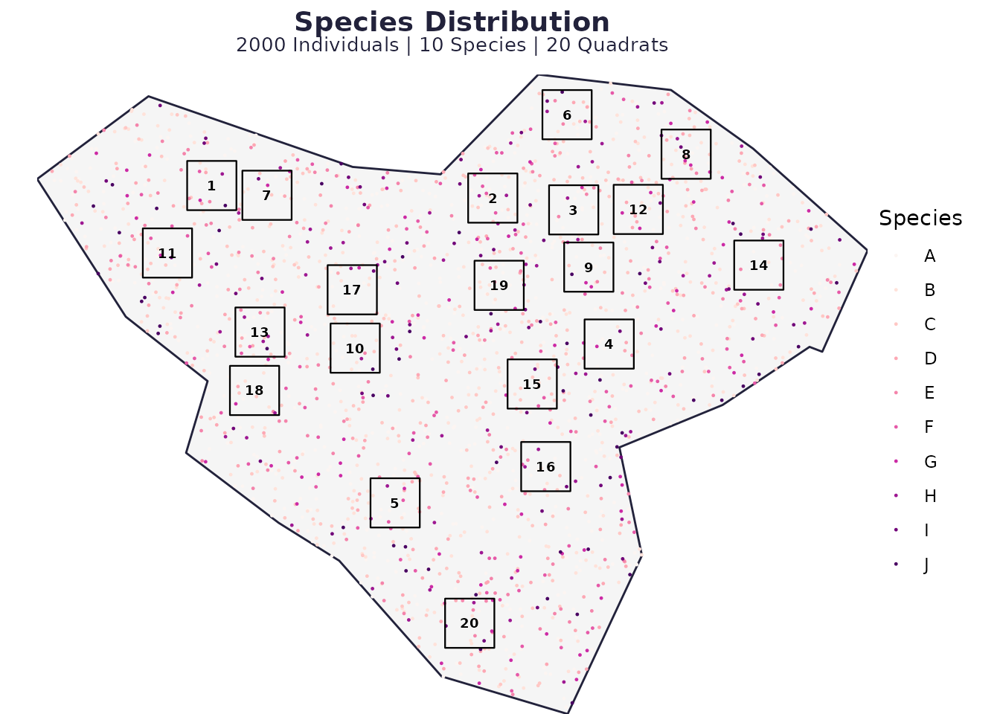
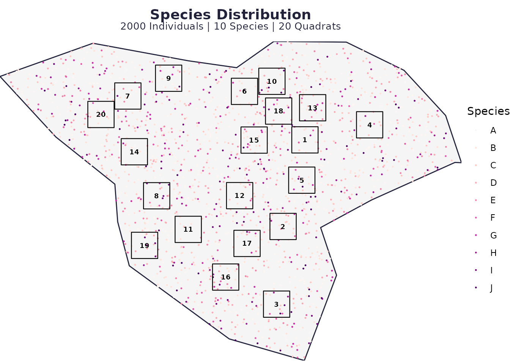
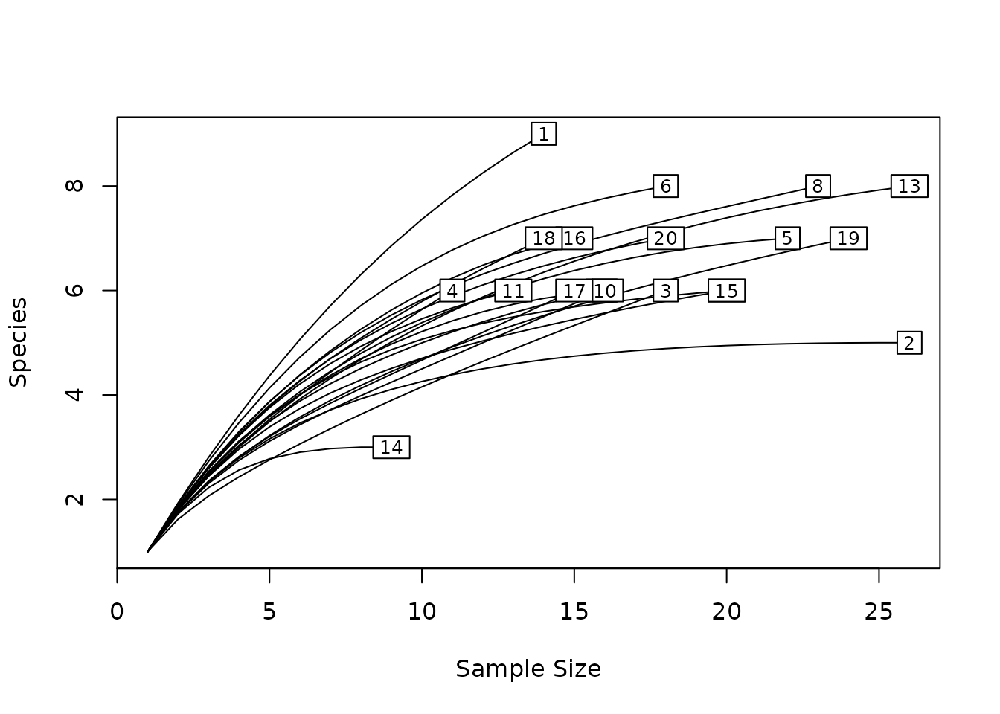
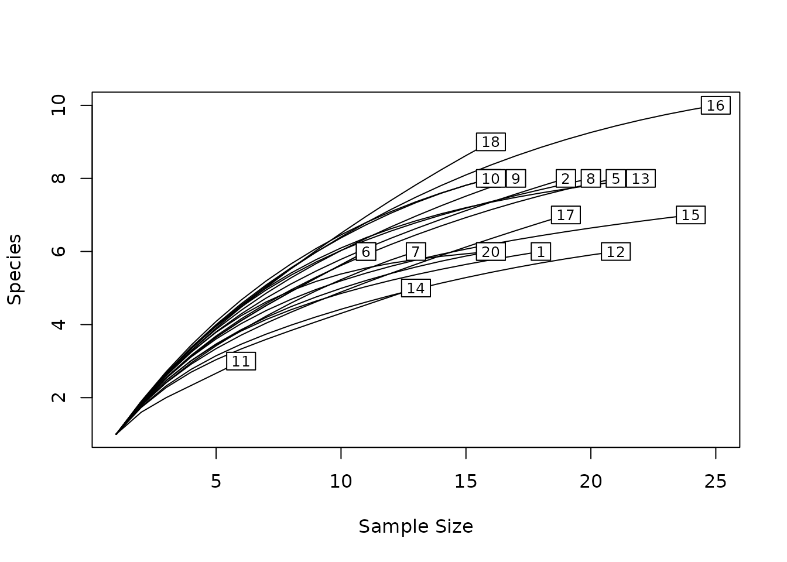
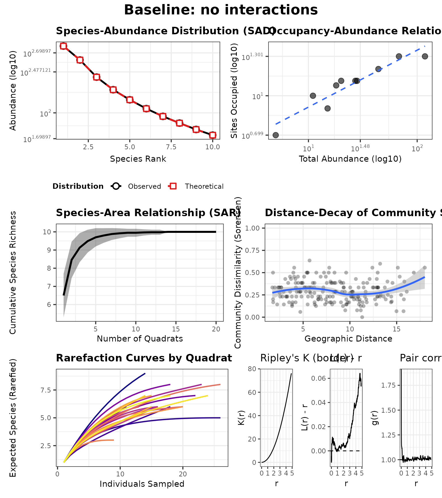
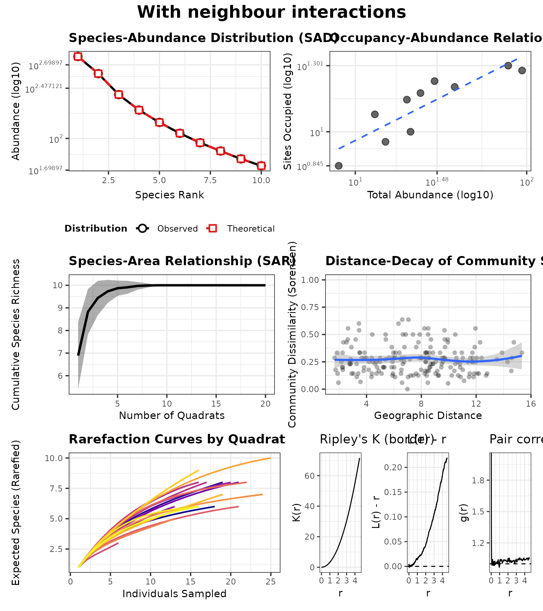

# spesim recipes: interspecific interactions

This recipe shows how to specify simple **neighbour effects** using
`INTERACTIONS_EDGELIST`.

Values:

- `< 1` suppressive (competition)
- `> 1` facilitative
- `= 1` neutral

## Baseline without interactions

``` r
library(spesim)
#> spesim loaded - try run_spatial_simulation() to generate a simulation.

P <- load_config(system.file("examples/spesim_init_basic.txt", package = "spesim"))
#> ========== INITIALISING SPATIAL SAMPLING SIMULATION ==========
P$N_SPECIES <- 10
P$N_INDIVIDUALS <- 2000
P$ADVANCED_ANALYSIS <- FALSE

# Turn interactions off
P$INTERACTION_RADIUS <- 0
P$INTERACTIONS_EDGELIST <- NULL

set.seed(P$SEED)
res0 <- run_spatial_simulation(P = P, write_outputs = FALSE, interactions_print = FALSE)
#> Note: no non-1 interactions for species: A, B, C, D, E, F, G, H, I, J.
#> ========== INITIALISING SPATIAL SAMPLING SIMULATION ==========
#> ========== SIMULATION PARAMETERS ==========
#> list(SEED = 77L, OUTPUT_PREFIX = "out/run_basic", N_INDIVIDUALS = 2000, 
#>     N_SPECIES = 10, DOMINANT_FRACTION = 0.3, FISHER_ALPHA = 4.2, 
#>     FISHER_X = 0.95, GRADIENT_SPECIES = c("A", "B", "C", "D"), 
#>     GRADIENT_ASSIGNMENTS = c("temperature", "temperature", "elevation", 
#>     "rainfall"), GRADIENT_OPTIMA = 0.5, GRADIENT_TOLERANCE = 0.12, 
#>     SAMPLING_RESOLUTION = 50L, ENVIRONMENTAL_NOISE = 0.05, MAX_CLUSTERS_DOMINANT = 5, 
#>     CLUSTER_SPREAD_DOMINANT = 3, INTERACTION_RADIUS = 0, INTERACTION_MATRIX = structure(c(1, 
#>     1, 1, 1, 1, 1, 1, 1, 1, 1, 1, 1, 1, 1, 1, 1, 1, 1, 1, 1, 
#>     1, 1, 1, 1, 1, 1, 1, 1, 1, 1, 1, 1, 1, 1, 1, 1, 1, 1, 1, 
#>     1, 1, 1, 1, 1, 1, 1, 1, 1, 1, 1, 1, 1, 1, 1, 1, 1, 1, 1, 
#>     1, 1, 1, 1, 1, 1, 1, 1, 1, 1, 1, 1, 1, 1, 1, 1, 1, 1, 1, 
#>     1, 1, 1, 1, 1, 1, 1, 1, 1, 1, 1, 1, 1, 1, 1, 1, 1, 1, 1, 
#>     1, 1, 1, 1), dim = c(10L, 10L), dimnames = list(c("A", "B", 
#>     "C", "D", "E", "F", "G", "H", "I", "J"), c("A", "B", "C", 
#>     "D", "E", "F", "G", "H", "I", "J"))), INTERACTIONS_FILE = NULL, 
#>     SAMPLING_SCHEME = "random", N_QUADRATS = 20L, QUADRAT_SIZE_OPTION = "medium", 
#>     N_TRANSECTS = 1, N_QUADRATS_PER_TRANSECT = 8, TRANSECT_ANGLE = 90, 
#>     VORONOI_SEED_FACTOR = 10, POINT_SIZE = 0.2, POINT_ALPHA = 1, 
#>     QUADRAT_ALPHA = 0.05, BACKGROUND_COLOUR = "white", FOREGROUND_COLOUR = "#22223b", 
#>     QUADRAT_COLOUR = "black", ADVANCED_ANALYSIS = FALSE, SPATIAL_PROCESS_A = "poisson", 
#>     A_PARENT_INTENSITY = NA_real_, A_MEAN_OFFSPRING = 10, A_CLUSTER_SCALE = 1, 
#>     SPATIAL_PROCESS_OTHERS = "poisson", OTHERS_BETA = NA_real_, 
#>     OTHERS_GAMMA = NA_real_, OTHERS_R = 1, OTHERS_S = 2, GRADIENT = structure(list(
#>         species = c("A", "B", "C", "D"), gradient = c("temperature", 
#>         "temperature", "elevation", "rainfall"), optimum = c(0.5, 
#>         0.5, 0.5, 0.5), tol = c(0.12, 0.12, 0.12, 0.12)), class = c("tbl_df", 
#>     "tbl", "data.frame"), row.names = c(NA, -4L))) 
#> 
#> ========== RUNNING SIMULATION ==========
#> Warning: attribute variables are assumed to be spatially constant throughout
#> all geometries
plot_spatial_sampling(res0$domain, res0$species_dist, res0$quadrats, res0$P)
```



## Add a few directed interaction rules

Here, species A suppresses B..D locally, and species C facilitates A.

``` r
P2 <- P
P2$INTERACTION_RADIUS <- 2
P2$INTERACTIONS_EDGELIST <- c(
  "A,B-D,0.7",
  "C,A,1.3"
)

res1 <- run_spatial_simulation(P = P2, write_outputs = FALSE, interactions_print = TRUE)
#> Note: no non-1 interactions for species: E, F, G, H, I, J.
#> ---- Interactions Summary ----
#> Species: 10 (A..J)
#> Radius : 2
#> Non-1 entries: 4 (4.0% of 100)
#> Asymmetry (mean |M - t(M)|): 0.024
#> 
#> Matrix ('.' = 1):
#>   A   B   C   D   E F G H I J
#> A .   0.7 0.7 0.7 . . . . . .
#> B .   .   .   .   . . . . . .
#> C 1.3 .   .   .   . . . . . .
#> D .   .   .   .   . . . . . .
#> E .   .   .   .   . . . . . .
#> F .   .   .   .   . . . . . .
#> G .   .   .   .   . . . . . .
#> H .   .   .   .   . . . . . .
#> I .   .   .   .   . . . . . .
#> J .   .   .   .   . . . . . .
#> 
#> Non-1 entries (sorted by |value-1|):
#>  focal neighbor value
#>      A        B   0.7
#>      A        C   0.7
#>      A        D   0.7
#>      C        A   1.3
#> ------------------------------
#> ========== INITIALISING SPATIAL SAMPLING SIMULATION ==========
#> ========== SIMULATION PARAMETERS ==========
#> list(SEED = 77L, OUTPUT_PREFIX = "out/run_basic", N_INDIVIDUALS = 2000, 
#>     N_SPECIES = 10, DOMINANT_FRACTION = 0.3, FISHER_ALPHA = 4.2, 
#>     FISHER_X = 0.95, GRADIENT_SPECIES = c("A", "B", "C", "D"), 
#>     GRADIENT_ASSIGNMENTS = c("temperature", "temperature", "elevation", 
#>     "rainfall"), GRADIENT_OPTIMA = 0.5, GRADIENT_TOLERANCE = 0.12, 
#>     SAMPLING_RESOLUTION = 50L, ENVIRONMENTAL_NOISE = 0.05, MAX_CLUSTERS_DOMINANT = 5, 
#>     CLUSTER_SPREAD_DOMINANT = 3, INTERACTION_RADIUS = 2, INTERACTION_MATRIX = structure(c(1, 
#>     1, 1.3, 1, 1, 1, 1, 1, 1, 1, 0.7, 1, 1, 1, 1, 1, 1, 1, 1, 
#>     1, 0.7, 1, 1, 1, 1, 1, 1, 1, 1, 1, 0.7, 1, 1, 1, 1, 1, 1, 
#>     1, 1, 1, 1, 1, 1, 1, 1, 1, 1, 1, 1, 1, 1, 1, 1, 1, 1, 1, 
#>     1, 1, 1, 1, 1, 1, 1, 1, 1, 1, 1, 1, 1, 1, 1, 1, 1, 1, 1, 
#>     1, 1, 1, 1, 1, 1, 1, 1, 1, 1, 1, 1, 1, 1, 1, 1, 1, 1, 1, 
#>     1, 1, 1, 1, 1, 1), dim = c(10L, 10L), dimnames = list(c("A", 
#>     "B", "C", "D", "E", "F", "G", "H", "I", "J"), c("A", "B", 
#>     "C", "D", "E", "F", "G", "H", "I", "J"))), INTERACTIONS_FILE = NULL, 
#>     SAMPLING_SCHEME = "random", N_QUADRATS = 20L, QUADRAT_SIZE_OPTION = "medium", 
#>     N_TRANSECTS = 1, N_QUADRATS_PER_TRANSECT = 8, TRANSECT_ANGLE = 90, 
#>     VORONOI_SEED_FACTOR = 10, POINT_SIZE = 0.2, POINT_ALPHA = 1, 
#>     QUADRAT_ALPHA = 0.05, BACKGROUND_COLOUR = "white", FOREGROUND_COLOUR = "#22223b", 
#>     QUADRAT_COLOUR = "black", ADVANCED_ANALYSIS = FALSE, SPATIAL_PROCESS_A = "poisson", 
#>     A_PARENT_INTENSITY = NA_real_, A_MEAN_OFFSPRING = 10, A_CLUSTER_SCALE = 1, 
#>     SPATIAL_PROCESS_OTHERS = "poisson", OTHERS_BETA = NA_real_, 
#>     OTHERS_GAMMA = NA_real_, OTHERS_R = 1, OTHERS_S = 2, GRADIENT = structure(list(
#>         species = c("A", "B", "C", "D"), gradient = c("temperature", 
#>         "temperature", "elevation", "rainfall"), optimum = c(0.5, 
#>         0.5, 0.5, 0.5), tol = c(0.12, 0.12, 0.12, 0.12)), class = c("tbl_df", 
#>     "tbl", "data.frame"), row.names = c(NA, -4L)), INTERACTIONS_EDGELIST = c("A,B-D,0.7", 
#>     "C,A,1.3")) 
#> 
#> ========== RUNNING SIMULATION ==========
#> Warning: attribute variables are assumed to be spatially constant throughout
#> all geometries

# Visualise the outcome
plot_spatial_sampling(res1$domain, res1$species_dist, res1$quadrats, res1$P)
```



## Consequences in the advanced analysis panel

Neighbour effects can change **co-occurrence patterns** and local
abundance, which in turn changes what you observe in quadrats.

In ecological terms, competition (coefficients \< 1) can create
**spatial segregation** and reduce local richness in neighbourhoods
dominated by a strong competitor, while facilitation (\> 1) can increase
local co-occurrence.

In the advanced panel, interaction effects can manifest as:

- shifts in **occupancy–abundance** (suppressed species become rarer and
  occupy fewer sites),
- changes in **distance–decay** (if interactions amplify patchiness),
- and altered **rarefaction** curves (effective evenness/richness per
  site).

``` r
panel0 <- generate_advanced_panel(res0) + patchwork::plot_annotation(title = "Baseline: no interactions")
```



``` r
panel1 <- generate_advanced_panel(res1) + patchwork::plot_annotation(title = "With neighbour interactions")
```



``` r
panel0
#> `geom_smooth()` using formula = 'y ~ x'
#> `geom_smooth()` using formula = 'y ~ x'
```



``` r
panel1
#> `geom_smooth()` using formula = 'y ~ x'
#> `geom_smooth()` using formula = 'y ~ x'
```



## Notes

- Rules are **directed** (`A -> B` need not equal `B -> A`).
- The global `INTERACTION_RADIUS` controls the neighbourhood size.
- Keep `INTERACTION_RADIUS = 0` to disable the modifier.
