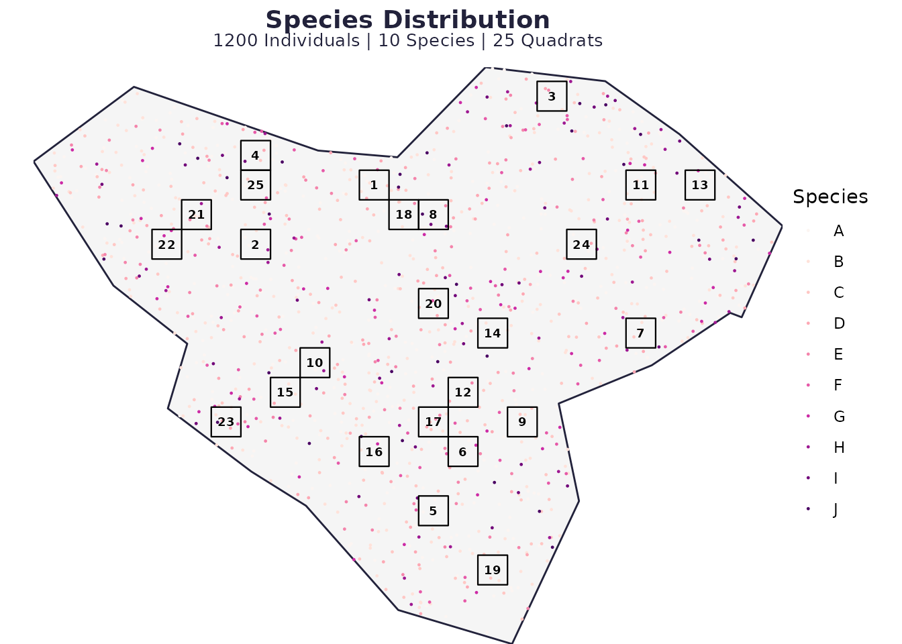
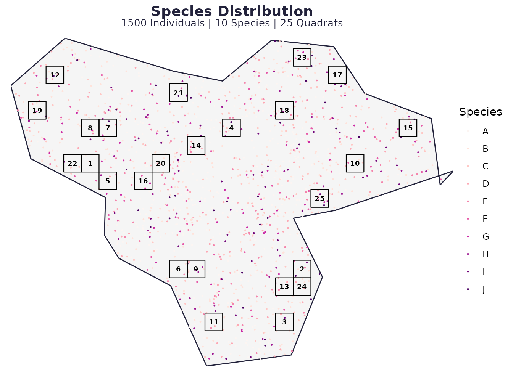
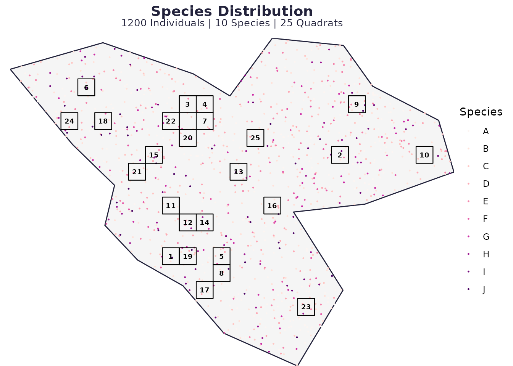
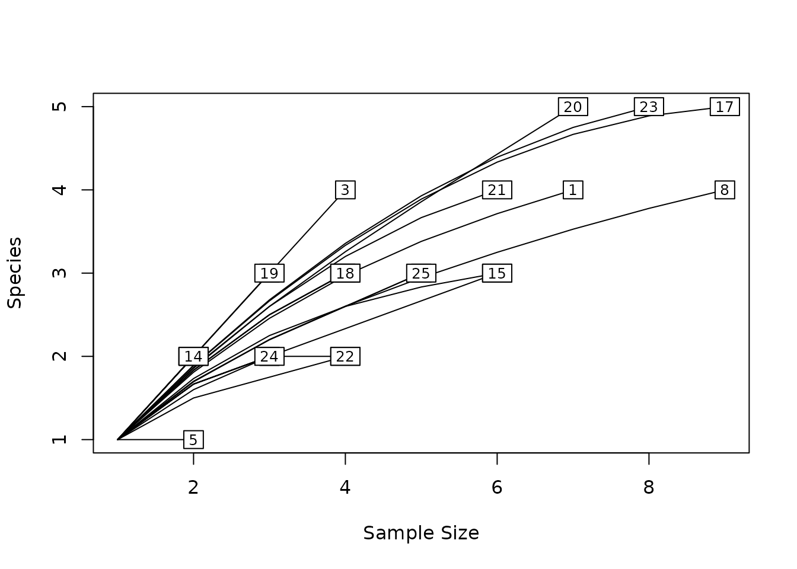
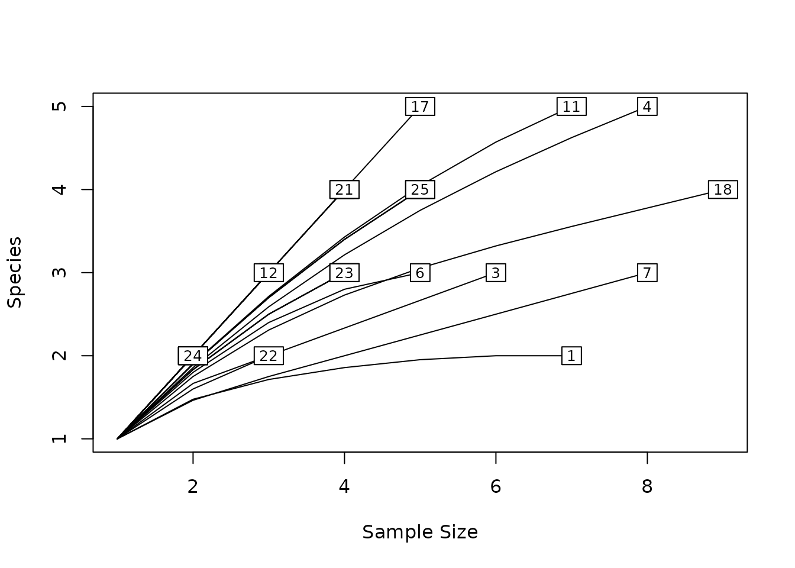
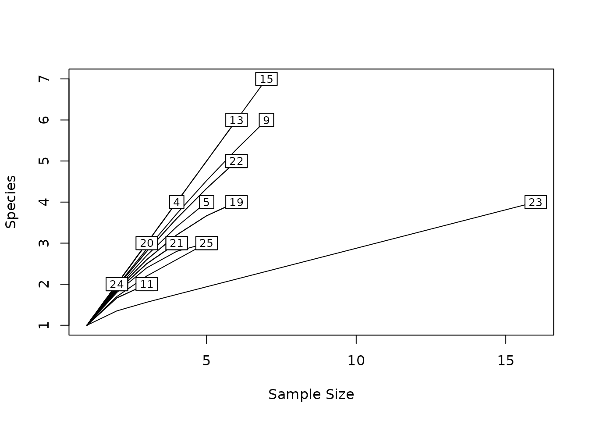
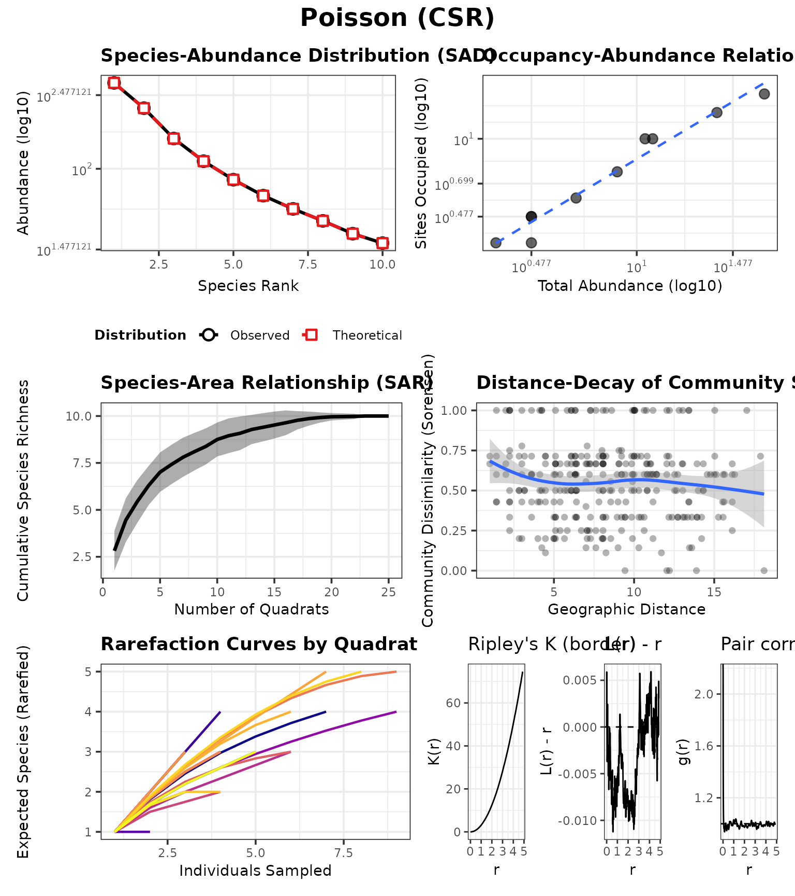
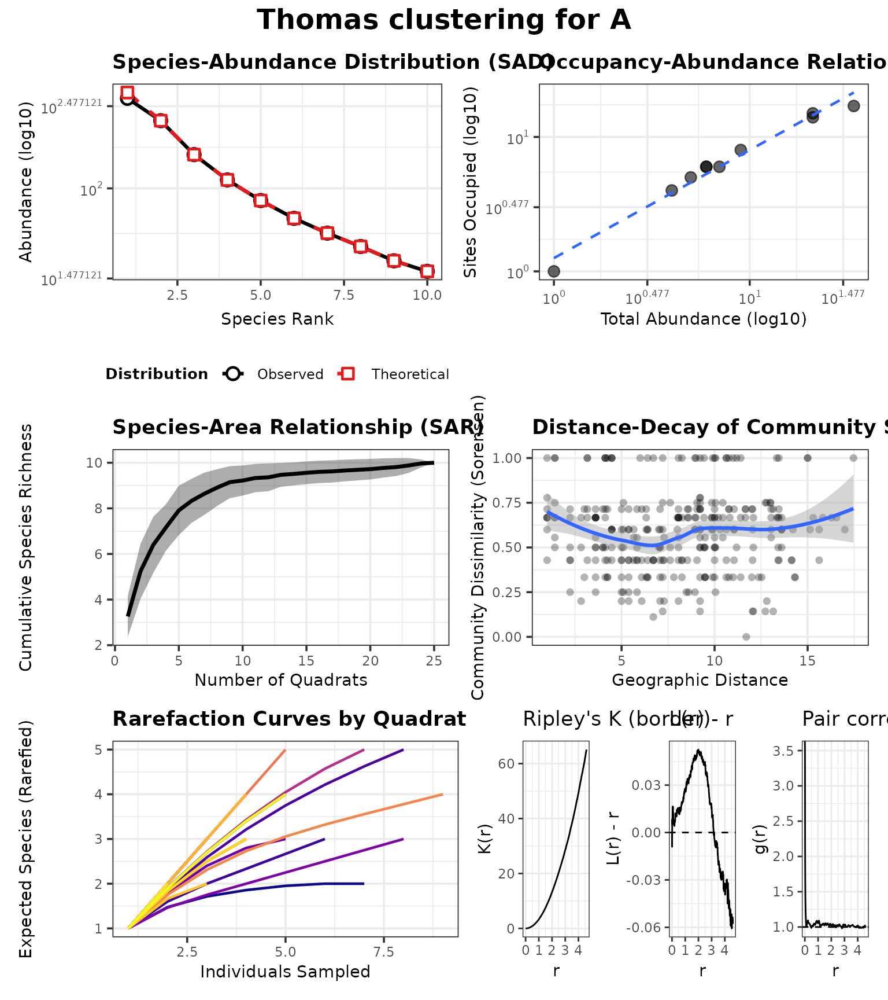
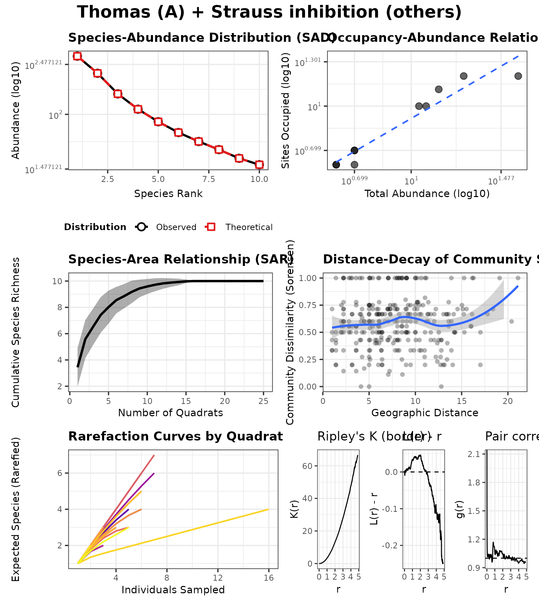

# spesim recipes: point processes (Poisson vs Thomas vs Strauss/Geyer)

This recipe shows how to switch the spatial point-process model for the
dominant species (A) and for the remaining species.

## Base configuration

``` r
library(spesim)
#> spesim loaded - try run_spatial_simulation() to generate a simulation.

P <- load_config(system.file("examples/spesim_init_complete.txt", package = "spesim"))
#> ========== INITIALISING SPATIAL SAMPLING SIMULATION ==========
P$N_SPECIES <- 10
P$N_INDIVIDUALS <- 1200
P$ADVANCED_ANALYSIS <- FALSE

# Keep interactions off for clarity
P$INTERACTION_RADIUS <- 0
P$INTERACTIONS_EDGELIST <- NULL
```

## Poisson: complete spatial randomness

``` r
P1 <- P
P1$SPATIAL_PROCESS_A <- "poisson"
P1$SPATIAL_PROCESS_OTHERS <- "poisson"

set.seed(P$SEED)
res_pois <- run_spatial_simulation(P = P1, write_outputs = FALSE, interactions_print = FALSE)
#> Warning in load_interactions(src_file, P$N_SPECIES): interactions_file not
#> found; interactions disabled.
#> Note: no non-1 interactions for species: A, B, C, D, E, F, G, H, I, J.
#> ========== INITIALISING SPATIAL SAMPLING SIMULATION ==========
#> ========== SIMULATION PARAMETERS ==========
#> list(SEED = 77L, OUTPUT_PREFIX = "out/run", N_INDIVIDUALS = 1200, 
#>     N_SPECIES = 10, DOMINANT_FRACTION = 0.3, FISHER_ALPHA = 4.2, 
#>     FISHER_X = 0.95, GRADIENT_SPECIES = c("A", "B", "C", "D"), 
#>     GRADIENT_ASSIGNMENTS = c("temperature", "temperature", "elevation", 
#>     "rainfall"), GRADIENT_OPTIMA = 0.5, GRADIENT_TOLERANCE = 0.12, 
#>     SAMPLING_RESOLUTION = 50L, ENVIRONMENTAL_NOISE = 0.05, MAX_CLUSTERS_DOMINANT = 5L, 
#>     CLUSTER_SPREAD_DOMINANT = 3, INTERACTION_RADIUS = 0, INTERACTION_MATRIX = structure(c(1, 
#>     1, 1, 1, 1, 1, 1, 1, 1, 1, 1, 1, 1, 1, 1, 1, 1, 1, 1, 1, 
#>     1, 1, 1, 1, 1, 1, 1, 1, 1, 1, 1, 1, 1, 1, 1, 1, 1, 1, 1, 
#>     1, 1, 1, 1, 1, 1, 1, 1, 1, 1, 1, 1, 1, 1, 1, 1, 1, 1, 1, 
#>     1, 1, 1, 1, 1, 1, 1, 1, 1, 1, 1, 1, 1, 1, 1, 1, 1, 1, 1, 
#>     1, 1, 1, 1, 1, 1, 1, 1, 1, 1, 1, 1, 1, 1, 1, 1, 1, 1, 1, 
#>     1, 1, 1, 1), dim = c(10L, 10L), dimnames = list(c("A", "B", 
#>     "C", "D", "E", "F", "G", "H", "I", "J"), c("A", "B", "C", 
#>     "D", "E", "F", "G", "H", "I", "J"))), INTERACTIONS_FILE = "interactions_init.txt", 
#>     SAMPLING_SCHEME = "tiled", N_QUADRATS = 25L, QUADRAT_SIZE_OPTION = "small", 
#>     N_TRANSECTS = 1L, N_QUADRATS_PER_TRANSECT = 8L, TRANSECT_ANGLE = 90L, 
#>     VORONOI_SEED_FACTOR = 10L, POINT_SIZE = 0.2, POINT_ALPHA = 1, 
#>     QUADRAT_ALPHA = 0.05, BACKGROUND_COLOUR = "#ffffff", FOREGROUND_COLOUR = "#22223b", 
#>     QUADRAT_COLOUR = "black", ADVANCED_ANALYSIS = FALSE, SPATIAL_PROCESS_A = "poisson", 
#>     A_PARENT_INTENSITY = NA_real_, A_MEAN_OFFSPRING = 12L, A_CLUSTER_SCALE = 1.2, 
#>     SPATIAL_PROCESS_OTHERS = "poisson", OTHERS_BETA = NA_real_, 
#>     OTHERS_GAMMA = NA_real_, OTHERS_R = 1, OTHERS_S = 0.6, GRADIENT = structure(list(
#>         species = c("A", "B", "C", "D"), gradient = c("temperature", 
#>         "temperature", "elevation", "rainfall"), optimum = c(0.5, 
#>         0.5, 0.5, 0.5), tol = c(0.12, 0.12, 0.12, 0.12)), class = c("tbl_df", 
#>     "tbl", "data.frame"), row.names = c(NA, -4L))) 
#> 
#> ========== RUNNING SIMULATION ==========
#> Warning: attribute variables are assumed to be spatially constant throughout
#> all geometries
plot_spatial_sampling(res_pois$domain, res_pois$species_dist, res_pois$quadrats, res_pois$P)
```



## Thomas clustering for the dominant species

``` r
P2 <- P
P2$SPATIAL_PROCESS_A <- "thomas"
P2$A_PARENT_INTENSITY <- NA
P2$A_MEAN_OFFSPRING <- 10
P2$A_CLUSTER_SCALE <- 1.0
P2$SPATIAL_PROCESS_OTHERS <- "poisson"

res_th <- run_spatial_simulation(P = P2, write_outputs = FALSE, interactions_print = FALSE)
#> Warning in load_interactions(src_file, P$N_SPECIES): interactions_file not
#> found; interactions disabled.
#> Note: no non-1 interactions for species: A, B, C, D, E, F, G, H, I, J.
#> ========== INITIALISING SPATIAL SAMPLING SIMULATION ==========
#> ========== SIMULATION PARAMETERS ==========
#> list(SEED = 77L, OUTPUT_PREFIX = "out/run", N_INDIVIDUALS = 1200, 
#>     N_SPECIES = 10, DOMINANT_FRACTION = 0.3, FISHER_ALPHA = 4.2, 
#>     FISHER_X = 0.95, GRADIENT_SPECIES = c("A", "B", "C", "D"), 
#>     GRADIENT_ASSIGNMENTS = c("temperature", "temperature", "elevation", 
#>     "rainfall"), GRADIENT_OPTIMA = 0.5, GRADIENT_TOLERANCE = 0.12, 
#>     SAMPLING_RESOLUTION = 50L, ENVIRONMENTAL_NOISE = 0.05, MAX_CLUSTERS_DOMINANT = 5L, 
#>     CLUSTER_SPREAD_DOMINANT = 3, INTERACTION_RADIUS = 0, INTERACTION_MATRIX = structure(c(1, 
#>     1, 1, 1, 1, 1, 1, 1, 1, 1, 1, 1, 1, 1, 1, 1, 1, 1, 1, 1, 
#>     1, 1, 1, 1, 1, 1, 1, 1, 1, 1, 1, 1, 1, 1, 1, 1, 1, 1, 1, 
#>     1, 1, 1, 1, 1, 1, 1, 1, 1, 1, 1, 1, 1, 1, 1, 1, 1, 1, 1, 
#>     1, 1, 1, 1, 1, 1, 1, 1, 1, 1, 1, 1, 1, 1, 1, 1, 1, 1, 1, 
#>     1, 1, 1, 1, 1, 1, 1, 1, 1, 1, 1, 1, 1, 1, 1, 1, 1, 1, 1, 
#>     1, 1, 1, 1), dim = c(10L, 10L), dimnames = list(c("A", "B", 
#>     "C", "D", "E", "F", "G", "H", "I", "J"), c("A", "B", "C", 
#>     "D", "E", "F", "G", "H", "I", "J"))), INTERACTIONS_FILE = "interactions_init.txt", 
#>     SAMPLING_SCHEME = "tiled", N_QUADRATS = 25L, QUADRAT_SIZE_OPTION = "small", 
#>     N_TRANSECTS = 1L, N_QUADRATS_PER_TRANSECT = 8L, TRANSECT_ANGLE = 90L, 
#>     VORONOI_SEED_FACTOR = 10L, POINT_SIZE = 0.2, POINT_ALPHA = 1, 
#>     QUADRAT_ALPHA = 0.05, BACKGROUND_COLOUR = "#ffffff", FOREGROUND_COLOUR = "#22223b", 
#>     QUADRAT_COLOUR = "black", ADVANCED_ANALYSIS = FALSE, SPATIAL_PROCESS_A = "thomas", 
#>     A_PARENT_INTENSITY = NA, A_MEAN_OFFSPRING = 10, A_CLUSTER_SCALE = 1, 
#>     SPATIAL_PROCESS_OTHERS = "poisson", OTHERS_BETA = NA_real_, 
#>     OTHERS_GAMMA = NA_real_, OTHERS_R = 1, OTHERS_S = 0.6, GRADIENT = structure(list(
#>         species = c("A", "B", "C", "D"), gradient = c("temperature", 
#>         "temperature", "elevation", "rainfall"), optimum = c(0.5, 
#>         0.5, 0.5, 0.5), tol = c(0.12, 0.12, 0.12, 0.12)), class = c("tbl_df", 
#>     "tbl", "data.frame"), row.names = c(NA, -4L))) 
#> 
#> ========== RUNNING SIMULATION ==========
#> Warning: attribute variables are assumed to be spatially constant throughout
#> all geometries
plot_spatial_sampling(res_th$domain, res_th$species_dist, res_th$quadrats, res_th$P)
```



## Mild inhibition for non-dominants (Strauss)

``` r
P3 <- P2
P3$SPATIAL_PROCESS_OTHERS <- "strauss"
P3$OTHERS_R <- 1.0
P3$OTHERS_S <- 0.5

res_st <- run_spatial_simulation(P = P3, write_outputs = FALSE, interactions_print = FALSE)
#> Warning in load_interactions(src_file, P$N_SPECIES): interactions_file not
#> found; interactions disabled.
#> Note: no non-1 interactions for species: A, B, C, D, E, F, G, H, I, J.
#> ========== INITIALISING SPATIAL SAMPLING SIMULATION ==========
#> ========== SIMULATION PARAMETERS ==========
#> list(SEED = 77L, OUTPUT_PREFIX = "out/run", N_INDIVIDUALS = 1200, 
#>     N_SPECIES = 10, DOMINANT_FRACTION = 0.3, FISHER_ALPHA = 4.2, 
#>     FISHER_X = 0.95, GRADIENT_SPECIES = c("A", "B", "C", "D"), 
#>     GRADIENT_ASSIGNMENTS = c("temperature", "temperature", "elevation", 
#>     "rainfall"), GRADIENT_OPTIMA = 0.5, GRADIENT_TOLERANCE = 0.12, 
#>     SAMPLING_RESOLUTION = 50L, ENVIRONMENTAL_NOISE = 0.05, MAX_CLUSTERS_DOMINANT = 5L, 
#>     CLUSTER_SPREAD_DOMINANT = 3, INTERACTION_RADIUS = 0, INTERACTION_MATRIX = structure(c(1, 
#>     1, 1, 1, 1, 1, 1, 1, 1, 1, 1, 1, 1, 1, 1, 1, 1, 1, 1, 1, 
#>     1, 1, 1, 1, 1, 1, 1, 1, 1, 1, 1, 1, 1, 1, 1, 1, 1, 1, 1, 
#>     1, 1, 1, 1, 1, 1, 1, 1, 1, 1, 1, 1, 1, 1, 1, 1, 1, 1, 1, 
#>     1, 1, 1, 1, 1, 1, 1, 1, 1, 1, 1, 1, 1, 1, 1, 1, 1, 1, 1, 
#>     1, 1, 1, 1, 1, 1, 1, 1, 1, 1, 1, 1, 1, 1, 1, 1, 1, 1, 1, 
#>     1, 1, 1, 1), dim = c(10L, 10L), dimnames = list(c("A", "B", 
#>     "C", "D", "E", "F", "G", "H", "I", "J"), c("A", "B", "C", 
#>     "D", "E", "F", "G", "H", "I", "J"))), INTERACTIONS_FILE = "interactions_init.txt", 
#>     SAMPLING_SCHEME = "tiled", N_QUADRATS = 25L, QUADRAT_SIZE_OPTION = "small", 
#>     N_TRANSECTS = 1L, N_QUADRATS_PER_TRANSECT = 8L, TRANSECT_ANGLE = 90L, 
#>     VORONOI_SEED_FACTOR = 10L, POINT_SIZE = 0.2, POINT_ALPHA = 1, 
#>     QUADRAT_ALPHA = 0.05, BACKGROUND_COLOUR = "#ffffff", FOREGROUND_COLOUR = "#22223b", 
#>     QUADRAT_COLOUR = "black", ADVANCED_ANALYSIS = FALSE, SPATIAL_PROCESS_A = "thomas", 
#>     A_PARENT_INTENSITY = NA, A_MEAN_OFFSPRING = 10, A_CLUSTER_SCALE = 1, 
#>     SPATIAL_PROCESS_OTHERS = "strauss", OTHERS_BETA = NA_real_, 
#>     OTHERS_GAMMA = NA_real_, OTHERS_R = 1, OTHERS_S = 0.5, GRADIENT = structure(list(
#>         species = c("A", "B", "C", "D"), gradient = c("temperature", 
#>         "temperature", "elevation", "rainfall"), optimum = c(0.5, 
#>         0.5, 0.5, 0.5), tol = c(0.12, 0.12, 0.12, 0.12)), class = c("tbl_df", 
#>     "tbl", "data.frame"), row.names = c(NA, -4L))) 
#> 
#> ========== RUNNING SIMULATION ==========
#> Warning: attribute variables are assumed to be spatially constant throughout
#> all geometries
plot_spatial_sampling(res_st$domain, res_st$species_dist, res_st$quadrats, res_st$P)
```



## Consequences in the advanced analysis panel

Different point processes correspond to different *mechanisms* of
spatial structure:

- **Poisson** is a null model (complete spatial randomness).
- **Thomas clustering** is a proxy for limited dispersal or patchy
  habitat suitability, producing aggregated individuals.
- **Strauss inhibition** approximates territoriality/space limitation,
  producing repulsion among points.

In the advanced panel, these differences often show up as:

- **distance–decay**: clustering can increase dissimilarity among
  quadrats, strengthening decay,
- **species–area**: more spatial structure can increase observed beta
  diversity, steepening the curve,
- **rarefaction**: strong aggregation can reduce per-quadrat richness at
  small sample sizes (more uneven encounter rates).

Below we compare the advanced panel between Poisson, Thomas (A
clustered), and Thomas + Strauss (others inhibited).

``` r
p_pois <- generate_advanced_panel(res_pois) + patchwork::plot_annotation(title = "Poisson (CSR)")
```



``` r
p_th   <- generate_advanced_panel(res_th)   + patchwork::plot_annotation(title = "Thomas clustering for A")
```



``` r
p_st   <- generate_advanced_panel(res_st)   + patchwork::plot_annotation(title = "Thomas (A) + Strauss inhibition (others)")
```



``` r
p_pois
#> `geom_smooth()` using formula = 'y ~ x'
#> `geom_smooth()` using formula = 'y ~ x'
```



``` r
p_th
#> `geom_smooth()` using formula = 'y ~ x'
#> `geom_smooth()` using formula = 'y ~ x'
```



``` r
p_st
#> `geom_smooth()` using formula = 'y ~ x'
#> `geom_smooth()` using formula = 'y ~ x'
```



## Notes

- In teaching, it often helps to hold everything else constant and vary
  one process knob at a time.
- If you want a more complete set of diagnostics, run
  `spesim_demo("advanced", make_plots = TRUE)` and inspect the advanced
  panel.
