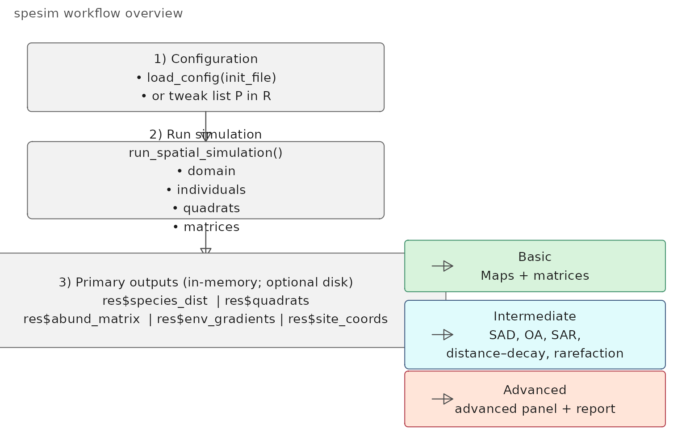
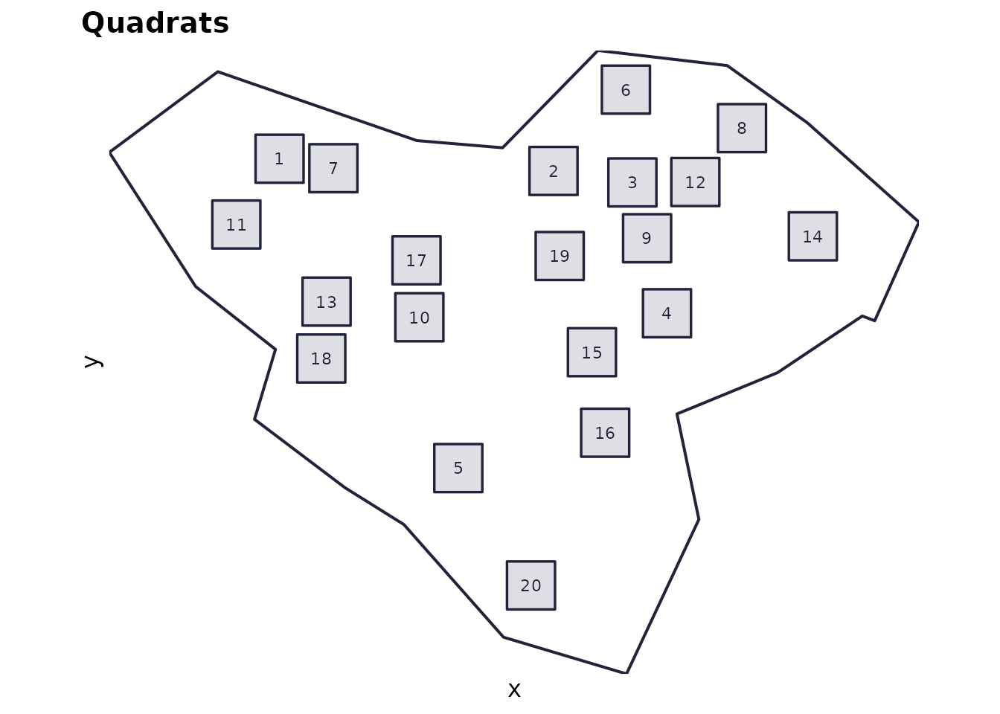
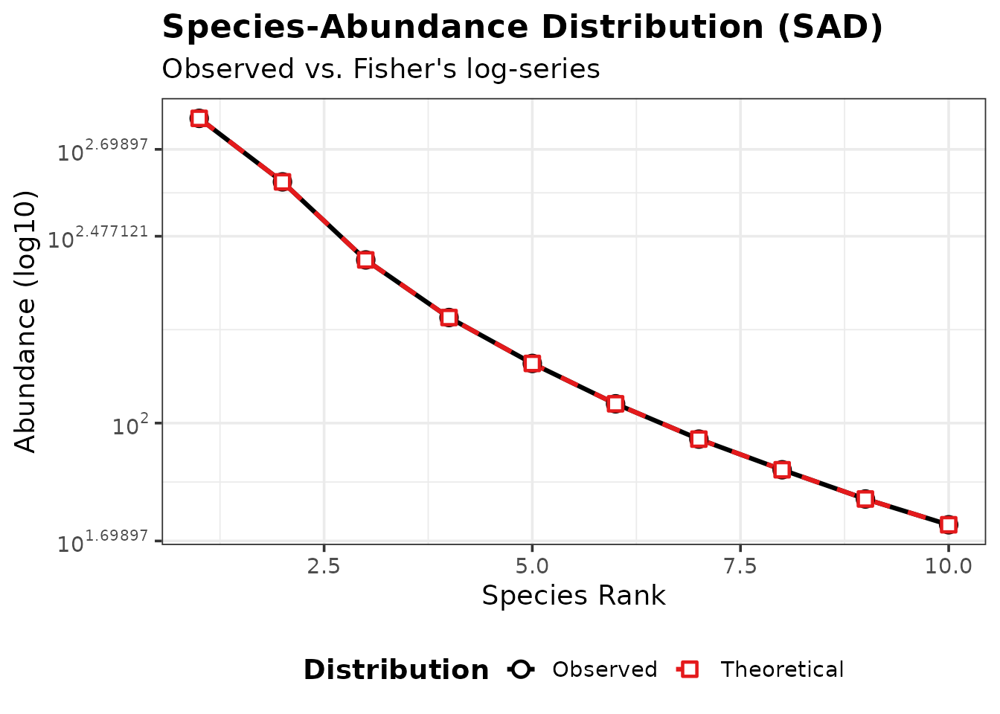

# spesim workflow: basic → intermediate → advanced

This vignette gives a structured overview of **what spesim can do**,
arranged as a progression from **basic** (fast, minimal outputs) through
**intermediate** (common teaching / exploration workflows) to
**advanced** (full reporting and diagnostic panels).

It is meant as a *map* of the package: which functions are involved,
what inputs and outputs to expect, and which “knobs” to turn at each
stage.

## Big picture workflow (flow diagram)

This diagram shows the main pipeline in a compact, teachable form.

``` r
# A dependency-free flow diagram (uses base R's grid package)
library(grid)

grid.newpage()

box <- function(x, y, w, h, label, gp = gpar(fill = "grey95", col = "grey40", lwd = 1)) {
  grid.roundrect(x, y, width = w, height = h, r = unit(0.06, "snpc"), gp = gp)
  grid.text(label, x, y, gp = gpar(col = "grey10", cex = 0.9))
}

arrow_down <- function(x, y0, y1) {
  grid.lines(x = unit(c(x, x), "npc"), y = unit(c(y0, y1), "npc"),
             gp = gpar(col = "grey30", lwd = 1.2),
             arrow = arrow(type = "closed", length = unit(0.12, "in")))
}

arrow_right <- function(x0, x1, y) {
  grid.lines(x = unit(c(x0, x1), "npc"), y = unit(c(y, y), "npc"),
             gp = gpar(col = "grey30", lwd = 1.1),
             arrow = arrow(type = "closed", length = unit(0.12, "in")))
}

# Main spine
box(0.30, 0.82, 0.52, 0.16,
    "1) Configuration\n• load_config(init_file)\n• or tweak list P in R")
arrow_down(0.30, 0.74, 0.67)

box(0.30, 0.58, 0.52, 0.18,
    "2) Run simulation\nrun_spatial_simulation()\n• domain\n• individuals\n• quadrats\n• matrices")
arrow_down(0.30, 0.47, 0.40)

box(0.30, 0.30, 0.70, 0.22,
    "3) Primary outputs (in-memory; optional disk)\nres$species_dist  | res$quadrats\nres$abund_matrix  | res$env_gradients | res$site_coords")

# Analysis branches
box(0.78, 0.38, 0.38, 0.12, "Basic\nMaps + matrices", gp = gpar(fill = "#d8f3dc", col = "#40916c"))
box(0.78, 0.22, 0.38, 0.16, "Intermediate\nSAD, OA, SAR,\ndistance–decay, rarefaction",
    gp = gpar(fill = "#e0fbfc", col = "#3d5a80"))
box(0.78, 0.07, 0.38, 0.13, "Advanced\nadvanced panel + report",
    gp = gpar(fill = "#ffe5d9", col = "#b23a48"))

arrow_right(0.63, 0.66, 0.38)
arrow_right(0.63, 0.66, 0.22)
arrow_right(0.63, 0.66, 0.07)

# Minor caption
grid.text("spesim workflow overview", x = unit(0.02, "npc"), y = unit(0.98, "npc"),
          just = c("left", "top"), gp = gpar(cex = 0.9, col = "grey30"))
```



## Three levels of use

### Level 1 — Basic (fast, minimal, robust)

**Goal:** run a small simulation quickly and get the essential objects
back for plotting and teaching.

**What you typically do**

``` r
library(spesim)
#> spesim loaded - try run_spatial_simulation() to generate a simulation.

# Start from a known-working example init file
init <- system.file("examples/spesim_init_basic.txt", package = "spesim")
P <- load_config(init)
#> ========== INITIALISING SPATIAL SAMPLING SIMULATION ==========

# Keep it fast (in-memory only)
P$ADVANCED_ANALYSIS <- FALSE
res <- run_spatial_simulation(P = P, write_outputs = FALSE)
#> Note: no non-1 interactions for species: A, B, C, D, E, F, G, H, I, J.
#> ---- Interactions Summary ----
#> Species: 10 (A..J)
#> Radius : 0
#> Non-1 entries: 0 (0.0% of 100)
#> 
#> Matrix ('.' = 1):
#>   A B C D E F G H I J
#> A . . . . . . . . . .
#> B . . . . . . . . . .
#> C . . . . . . . . . .
#> D . . . . . . . . . .
#> E . . . . . . . . . .
#> F . . . . . . . . . .
#> G . . . . . . . . . .
#> H . . . . . . . . . .
#> I . . . . . . . . . .
#> J . . . . . . . . . .
#> ------------------------------
#> ========== INITIALISING SPATIAL SAMPLING SIMULATION ==========
#> ========== SIMULATION PARAMETERS ==========
#> list(SEED = 77L, OUTPUT_PREFIX = "out/run_basic", N_INDIVIDUALS = 2000L, 
#>     N_SPECIES = 10L, DOMINANT_FRACTION = 0.3, FISHER_ALPHA = 4.2, 
#>     FISHER_X = 0.95, GRADIENT_SPECIES = c("A", "B", "C", "D"), 
#>     GRADIENT_ASSIGNMENTS = c("temperature", "temperature", "elevation", 
#>     "rainfall"), GRADIENT_OPTIMA = 0.5, GRADIENT_TOLERANCE = 0.12, 
#>     SAMPLING_RESOLUTION = 50L, ENVIRONMENTAL_NOISE = 0.05, MAX_CLUSTERS_DOMINANT = 5, 
#>     CLUSTER_SPREAD_DOMINANT = 3, INTERACTION_RADIUS = 0, INTERACTION_MATRIX = structure(c(1, 
#>     1, 1, 1, 1, 1, 1, 1, 1, 1, 1, 1, 1, 1, 1, 1, 1, 1, 1, 1, 
#>     1, 1, 1, 1, 1, 1, 1, 1, 1, 1, 1, 1, 1, 1, 1, 1, 1, 1, 1, 
#>     1, 1, 1, 1, 1, 1, 1, 1, 1, 1, 1, 1, 1, 1, 1, 1, 1, 1, 1, 
#>     1, 1, 1, 1, 1, 1, 1, 1, 1, 1, 1, 1, 1, 1, 1, 1, 1, 1, 1, 
#>     1, 1, 1, 1, 1, 1, 1, 1, 1, 1, 1, 1, 1, 1, 1, 1, 1, 1, 1, 
#>     1, 1, 1, 1), dim = c(10L, 10L), dimnames = list(c("A", "B", 
#>     "C", "D", "E", "F", "G", "H", "I", "J"), c("A", "B", "C", 
#>     "D", "E", "F", "G", "H", "I", "J"))), INTERACTIONS_FILE = NULL, 
#>     INTERACTIONS_EDGELIST = NULL, SAMPLING_SCHEME = "random", 
#>     N_QUADRATS = 20L, QUADRAT_SIZE_OPTION = "medium", N_TRANSECTS = 1, 
#>     N_QUADRATS_PER_TRANSECT = 8, TRANSECT_ANGLE = 90, VORONOI_SEED_FACTOR = 10, 
#>     POINT_SIZE = 0.2, POINT_ALPHA = 1, QUADRAT_ALPHA = 0.05, 
#>     BACKGROUND_COLOUR = "white", FOREGROUND_COLOUR = "#22223b", 
#>     QUADRAT_COLOUR = "black", ADVANCED_ANALYSIS = FALSE, SPATIAL_PROCESS_A = "poisson", 
#>     A_PARENT_INTENSITY = NA_real_, A_MEAN_OFFSPRING = 10, A_CLUSTER_SCALE = 1, 
#>     SPATIAL_PROCESS_OTHERS = "poisson", OTHERS_BETA = NA_real_, 
#>     OTHERS_GAMMA = NA_real_, OTHERS_R = 1, OTHERS_S = 2, GRADIENT = structure(list(
#>         species = c("A", "B", "C", "D"), gradient = c("temperature", 
#>         "temperature", "elevation", "rainfall"), optimum = c(0.5, 
#>         0.5, 0.5, 0.5), tol = c(0.12, 0.12, 0.12, 0.12)), class = c("tbl_df", 
#>     "tbl", "data.frame"), row.names = c(NA, -4L))) 
#> 
#> ========== RUNNING SIMULATION ==========
#> Warning: attribute variables are assumed to be spatially constant throughout
#> all geometries

names(res)
#> [1] "P"             "domain"        "species_dist"  "quadrats"     
#> [5] "env_gradients" "abund_matrix"  "site_coords"
```

**Useful objects at this level**

- `res$domain` — sampling domain polygon
- `res$species_dist` — individuals as sf POINTS with a `species` column
- `res$quadrats` — quadrat polygons with `quadrat_id`
- `res$abund_matrix` — site × species abundance table

**Basic visualisations**

``` r
# Domain + quadrats
plot_quadrats(res$domain, res$quadrats, title = "Quadrats")
```



### Level 2 — Intermediate (typical analyses + teaching plots)

**Goal:** use the returned objects to compute common community-ecology
summaries.

These are the same components that appear in the “advanced panel”, but
here you can compute/plot them separately or integrate them into
lessons.

Typical intermediate steps:

- **Rank–abundance** (SAD):
  - `calculate_rank_abundance(res$species_dist, res$P)`
  - `plot_rank_abundance(...)`
- **Occupancy–abundance**:
  - `calculate_occupancy_abundance(res$abund_matrix)`
  - `plot_occupancy_abundance(...)`
- **Species–area curve (SAR)**:
  - `calculate_species_area(res$abund_matrix)`
  - `plot_species_area(...)`
- **Distance–decay**:
  - `calculate_distance_decay(res$abund_matrix, res$site_coords)`
  - `plot_distance_decay(...)`
- **Rarefaction**:
  - `calculate_rarefaction(res$abund_matrix)`
  - `plot_rarefaction(...)`

Example (one intermediate product):

``` r
ra <- calculate_rank_abundance(res$species_dist, res$P)
plot_rank_abundance(ra)
```



### Level 3 — Advanced (full diagnostics + report)

**Goal:** generate a compact **multi-plot diagnostic panel** and a
**human-readable report**.

There are two ways to do this:

1.  **In-memory** (useful for notebooks and teaching):

``` r
panel <- generate_advanced_panel(res)
print(panel)
cat(generate_full_report(res))
```

2.  **Write to disk** (useful for “run it and inspect outputs”
    workflows):

``` r
# This will write timestamped outputs under out/demo_YYYYMMDD... etc.
res2 <- run_spatial_simulation(P = P, write_outputs = TRUE, output_prefix = "out/demo")
```

## Capability map (what features live where?)

### Configuration capabilities

- “Init file” workflow: `load_config("path/to/init.txt")`
- In-memory workflow:
  `P <- load_config(example); P$N_SPECIES <- 10; ...`

Key configuration families:

- **Community size + SAD:** `N_SPECIES`, `N_INDIVIDUALS`,
  `DOMINANT_FRACTION`, `FISHER_ALPHA`, `FISHER_X`
- **Environmental filtering:** `GRADIENT_*` plus `SAMPLING_RESOLUTION`,
  `ENVIRONMENTAL_NOISE`
- **Point processes:** `SPATIAL_PROCESS_A`, `SPATIAL_PROCESS_OTHERS` and
  their parameters
- **Interactions:** `INTERACTION_RADIUS`, `INTERACTIONS_EDGELIST` or
  `INTERACTIONS_FILE`
- **Sampling design:** `SAMPLING_SCHEME` and scheme-specific parameters

### Sampling design capabilities (quadrats)

- random:
  [`place_quadrats()`](https://ajsmit.github.io/spesim/reference/place_quadrats.md)
- tiled:
  [`place_quadrats_tiled()`](https://ajsmit.github.io/spesim/reference/place_quadrats_tiled.md)
- systematic:
  [`place_quadrats_systematic()`](https://ajsmit.github.io/spesim/reference/place_quadrats_systematic.md)
- transect:
  [`place_quadrats_transect()`](https://ajsmit.github.io/spesim/reference/place_quadrats_transect.md)
- Voronoi-based: `place_quadrats_voronoi(show_voronoi=TRUE)` for
  teaching/visualisation

See the dedicated vignette: **“Quadrat placement schemes in spesim”**.

## A practical “ladder” you can teach from

A suggested progression for a lab/class:

1.  **Basic run** (small, fast) → inspect `res$species_dist`,
    `res$quadrats`, `res$abund_matrix`.
2.  Turn on **gradients** → show how optima/tolerance shapes spatial
    pattern.
3.  Compare **sampling schemes** → show how design changes the observed
    matrix.
4.  Turn on **interactions** → show how neighbourhood effects alter
    co-occurrence.
5.  Run the **advanced panel** → interpret each diagnostic.
6.  Read the **full report** → emphasise reproducibility and “what
    happened?” narratives.

## Reproducibility notes

- [`load_config()`](https://ajsmit.github.io/spesim/reference/load_config.md)
  sets a seed (from the init file) for reproducibility.
- Some intermediate analyses (e.g., SAR permutations) use randomness
  internally; set `set.seed(...)` before calling if you want exact
  repeatability.
